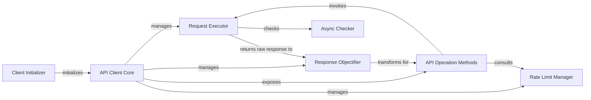

## Details

The PRAW Reddit API client is structured around the `API Client Core`, which serves as the primary interface for users. This core is set up by the `Client Initializer`, configuring essential components like the HTTP client and response parsing. User interactions, such as fetching data or creating posts, are handled by `API Operation Methods`. These methods delegate the actual HTTP communication to the `Request Executor`, which may consult the `Async Checker` for proper asynchronous execution. Upon receiving a raw response, the `Request Executor` passes it to the `Response Objectifier` for transformation into structured Python objects, which are then returned to the `API Operation Methods`. Throughout this process, the `Rate Limit Manager` is consulted to ensure adherence to Reddit's API usage policies, with the `API Client Core` overseeing and managing these interactions.

### API Client Core [[Expand]](./API_Client_Core.md)
Serves as the main entry point for users to interact with the Reddit API. It orchestrates all underlying operations, manages the client's state, and exposes a high-level, object-oriented interface.

**Related Classes/Methods**:

- <a href="https://github.com/CodeBoarding/praw/blob/main/praw/reddit.py#L57-L901" target="_blank" rel="noopener noreferrer">`praw.reddit.Reddit`:57-901</a>

### Client Initializer
Sets up the API Client Core instance, including configuring the underlying HTTP client (prawcore) and the response objectification mechanism. It integrates `prawcore` for HTTP requests and the `Objector` for response parsing.

**Related Classes/Methods**:

- <a href="https://github.com/CodeBoarding/praw/blob/main/praw/reddit.py" target="_blank" rel="noopener noreferrer">`praw.reddit.Reddit.__init__`</a>
- <a href="https://github.com/CodeBoarding/praw/blob/main/praw/reddit.py#L527-L546" target="_blank" rel="noopener noreferrer">`praw.reddit._prepare_prawcore`:527-546</a>
- <a href="https://github.com/CodeBoarding/praw/blob/main/praw/reddit.py#L479-L525" target="_blank" rel="noopener noreferrer">`praw.reddit._prepare_objector`:479-525</a>

### Request Executor
Executes the raw HTTP requests to the Reddit API, handling the low-level communication details.

**Related Classes/Methods**:

- <a href="https://github.com/CodeBoarding/praw/blob/main/praw/reddit.py" target="_blank" rel="noopener noreferrer">`praw.reddit.Reddit.request`</a>

### Response Objectifier
Transforms the raw JSON responses from the API into structured PRAW Python objects, making them easier to consume and work with.

**Related Classes/Methods**:

- <a href="https://github.com/CodeBoarding/praw/blob/main/praw/reddit.py" target="_blank" rel="noopener noreferrer">`praw.reddit.Reddit._objectify_request`</a>

### Rate Limit Manager
Monitors and enforces Reddit's API rate limits, pausing requests when necessary to prevent exceeding usage quotas and ensuring compliance.

**Related Classes/Methods**:

- <a href="https://github.com/CodeBoarding/praw/blob/main/praw/reddit.py" target="_blank" rel="noopener noreferrer">`praw.reddit.Reddit._handle_rate_limit`</a>

### API Operation Methods
Provide specific, high-level methods for common API operations (e.g., fetching data, creating posts, deleting resources), abstracting the underlying request and response handling details from the end-user.

**Related Classes/Methods**:

- <a href="https://github.com/CodeBoarding/praw/blob/main/praw/reddit.py" target="_blank" rel="noopener noreferrer">`praw.reddit.Reddit.get`</a>
- <a href="https://github.com/CodeBoarding/praw/blob/main/praw/reddit.py" target="_blank" rel="noopener noreferrer">`praw.reddit.Reddit.post`</a>
- <a href="https://github.com/CodeBoarding/praw/blob/main/praw/reddit.py" target="_blank" rel="noopener noreferrer">`praw.reddit.Reddit.delete`</a>
- <a href="https://github.com/CodeBoarding/praw/blob/main/praw/reddit.py" target="_blank" rel="noopener noreferrer">`praw.reddit.Reddit.patch`</a>
- <a href="https://github.com/CodeBoarding/praw/blob/main/praw/reddit.py" target="_blank" rel="noopener noreferrer">`praw.reddit.Reddit.put`</a>

### Async Checker
Manages and verifies the asynchronous context for operations, ensuring proper execution in async environments.

**Related Classes/Methods**:

- <a href="https://github.com/CodeBoarding/praw/blob/main/praw/reddit.py#L388-L411" target="_blank" rel="noopener noreferrer">`praw.reddit._check_for_async`:388-411</a>

### [FAQ](https://github.com/CodeBoarding/GeneratedOnBoardings/tree/main?tab=readme-ov-file#faq)
