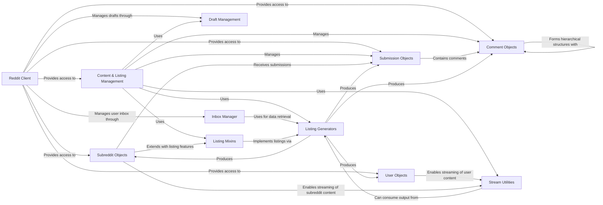

## Component Details

This graph illustrates the architecture of the Content & Listing Management subsystem within the PRAW library, focusing on how it retrieves, iterates, and manages various types of Reddit content. The core functionality revolves around efficient listing generation and the handling of submissions, comments, and related data like drafts and polls. It interacts with the central Reddit Client for API access and leverages specialized components for listing generation, stream utilities, and specific Reddit object management.

### Reddit Client
The central entry point for interacting with the Reddit API, managing authentication and providing access to various Reddit entities.

**Related Classes/Methods**:

- <a href="https://github.com/praw-dev/praw/blob/master/praw/reddit.py#L57-L901" target="_blank" rel="noopener noreferrer">`praw.praw.reddit.Reddit` (57:901)</a>

### Content & Listing Management
Responsible for efficiently retrieving and iterating through various types of content listings from Reddit, such as hot, new, or top posts. It also provides utilities for real-time data streams and handles the creation, retrieval, and general management of Reddit submissions (posts) and comments, including drafts and poll data.

**Related Classes/Methods**:

- <a href="https://github.com/praw-dev/praw/blob/master/praw/models/listing/generator.py#L17-L103" target="_blank" rel="noopener noreferrer">`praw.praw.models.listing.generator.ListingGenerator` (17:103)</a>
- <a href="https://github.com/praw-dev/praw/blob/master/praw/models/listing/domain.py#L14-L25" target="_blank" rel="noopener noreferrer">`praw.praw.models.listing.domain.DomainListing` (14:25)</a>
- <a href="https://github.com/praw-dev/praw/blob/master/praw/models/listing/mixins/redditor.py#L18-L32" target="_blank" rel="noopener noreferrer">`praw.praw.models.listing.mixins.redditor.SubListing` (18:32)</a>
- <a href="https://github.com/praw-dev/praw/blob/master/praw/models/listing/mixins/redditor.py#L35-L185" target="_blank" rel="noopener noreferrer">`praw.praw.models.listing.mixins.redditor.RedditorListingMixin` (35:185)</a>
- <a href="https://github.com/praw-dev/praw/blob/master/praw/models/listing/mixins/subreddit.py#L20-L46" target="_blank" rel="noopener noreferrer">`praw.praw.models.listing.mixins.subreddit.CommentHelper` (20:46)</a>
- <a href="https://github.com/praw-dev/praw/blob/master/praw/models/listing/mixins/subreddit.py#L49-L73" target="_blank" rel="noopener noreferrer">`praw.praw.models.listing.mixins.subreddit.SubredditListingMixin` (49:73)</a>
- <a href="https://github.com/praw-dev/praw/blob/master/praw/models/listing/mixins/rising.py#L17-L34" target="_blank" rel="noopener noreferrer">`praw.praw.models.listing.mixins.rising.RisingListingMixin` (17:34)</a>
- <a href="https://github.com/praw-dev/praw/blob/master/praw/models/listing/mixins/base.py#L15-L149" target="_blank" rel="noopener noreferrer">`praw.praw.models.listing.mixins.base.BaseListingMixin` (15:149)</a>
- <a href="https://github.com/praw-dev/praw/blob/master/praw/models/listing/mixins/submission.py#L17-L42" target="_blank" rel="noopener noreferrer">`praw.praw.models.listing.mixins.submission.SubmissionListingMixin` (17:42)</a>
- <a href="https://github.com/praw-dev/praw/blob/master/praw/models/util.py#L10-L190" target="_blank" rel="noopener noreferrer">`praw.praw.models.util` (10:190)</a>
- <a href="https://github.com/praw-dev/praw/blob/master/praw/models/comment_forest.py#L15-L202" target="_blank" rel="noopener noreferrer">`praw.praw.models.comment_forest.CommentForest` (15:202)</a>
- <a href="https://github.com/praw-dev/praw/blob/master/praw/models/reddit/comment.py#L19-L311" target="_blank" rel="noopener noreferrer">`praw.praw.models.reddit.comment.Comment` (19:311)</a>
- <a href="https://github.com/praw-dev/praw/blob/master/praw/models/reddit/comment.py#L314-L350" target="_blank" rel="noopener noreferrer">`praw.praw.models.reddit.comment.CommentModeration` (314:350)</a>
- <a href="https://github.com/praw-dev/praw/blob/master/praw/models/reddit/more.py#L14-L87" target="_blank" rel="noopener noreferrer">`praw.praw.models.reddit.more.MoreComments` (14:87)</a>
- <a href="https://github.com/praw-dev/praw/blob/master/praw/models/reddit/submission.py#L395-L916" target="_blank" rel="noopener noreferrer">`praw.praw.models.reddit.submission.Submission` (395:916)</a>
- <a href="https://github.com/praw-dev/praw/blob/master/praw/models/reddit/submission.py#L40-L90" target="_blank" rel="noopener noreferrer">`praw.praw.models.reddit.submission.SubmissionFlair` (40:90)</a>
- <a href="https://github.com/praw-dev/praw/blob/master/praw/models/reddit/submission.py#L93-L392" target="_blank" rel="noopener noreferrer">`praw.praw.models.reddit.submission.SubmissionModeration` (93:392)</a>
- <a href="https://github.com/praw-dev/praw/blob/master/praw/models/helpers.py#L20-L133" target="_blank" rel="noopener noreferrer">`praw.praw.models.helpers.DraftHelper` (20:133)</a>
- <a href="https://github.com/praw-dev/praw/blob/master/praw/models/reddit/draft.py#L17-L292" target="_blank" rel="noopener noreferrer">`praw.praw.models.reddit.draft.Draft` (17:292)</a>
- <a href="https://github.com/praw-dev/praw/blob/master/praw/models/reddit/poll.py#L47-L112" target="_blank" rel="noopener noreferrer">`praw.praw.models.reddit.poll.PollData` (47:112)</a>
- <a href="https://github.com/praw-dev/praw/blob/master/praw/models/reddit/poll.py#L11-L44" target="_blank" rel="noopener noreferrer">`praw.praw.models.reddit.poll.PollOption` (11:44)</a>

### Listing Generators
A core component responsible for iterating and fetching paginated lists of various Reddit objects.

**Related Classes/Methods**:

- <a href="https://github.com/praw-dev/praw/blob/master/praw/models/listing/generator.py#L17-L103" target="_blank" rel="noopener noreferrer">`praw.models.listing.generator.ListingGenerator` (17:103)</a>

### Comment Objects
Represents individual Reddit comments, providing methods for interaction and retrieval of related data.

**Related Classes/Methods**:

- <a href="https://github.com/praw-dev/praw/blob/master/praw/models/reddit/comment.py#L19-L311" target="_blank" rel="noopener noreferrer">`praw.praw.models.reddit.comment.Comment` (19:311)</a>

### Submission Objects
Represents Reddit posts (submissions), offering functionalities for content manipulation and moderation.

**Related Classes/Methods**:

- <a href="https://github.com/praw-dev/praw/blob/master/praw/models/reddit/submission.py#L395-L916" target="_blank" rel="noopener noreferrer">`praw.praw.models.reddit.submission.Submission` (395:916)</a>

### Subreddit Objects
Represents Reddit communities (subreddits), enabling content submission and moderation within them.

**Related Classes/Methods**:

- `praw.praw.models.reddit.subreddit.Subreddit` (full file reference)

### User Objects
Represents Reddit user accounts, providing access to user-specific content and profiles.

**Related Classes/Methods**:

- <a href="https://github.com/praw-dev/praw/blob/master/praw/models/reddit/redditor.py#L21-L409" target="_blank" rel="noopener noreferrer">`praw.praw.models.reddit.redditor.Redditor` (21:409)</a>

### Inbox Manager
Manages the authenticated user's Reddit inbox, allowing retrieval of messages, comment replies, and mentions.

**Related Classes/Methods**:

- <a href="https://github.com/praw-dev/praw/blob/master/praw/models/inbox.py#L18-L324" target="_blank" rel="noopener noreferrer">`praw.praw.models.inbox.Inbox` (18:324)</a>

### Draft Management
Provides utilities for creating and managing submission drafts.

**Related Classes/Methods**:

- <a href="https://github.com/praw-dev/praw/blob/master/praw/models/helpers.py#L20-L133" target="_blank" rel="noopener noreferrer">`praw.praw.models.helpers.DraftHelper` (20:133)</a>

### Stream Utilities
Offers helper functions for continuously streaming new Reddit content, such as comments or submissions.

**Related Classes/Methods**:

- <a href="https://github.com/praw-dev/praw/blob/master/praw/models/util.py#L36-L163" target="_blank" rel="noopener noreferrer">`praw.praw.models.util.stream_generator` (36:163)</a>

### Listing Mixins
Abstract classes providing common methods for fetching various types of listings (e.g., hot, new, top) across different Reddit entities.

**Related Classes/Methods**:

- <a href="https://github.com/praw-dev/praw/blob/master/praw/models/listing/mixins/base.py#L15-L149" target="_blank" rel="noopener noreferrer">`praw.praw.models.listing.mixins.base.BaseListingMixin` (15:149)</a>
- <a href="https://github.com/praw-dev/praw/blob/master/praw/models/listing/mixins/redditor.py#L35-L185" target="_blank" rel="noopener noreferrer">`praw.praw.models.listing.mixins.redditor.RedditorListingMixin` (35:185)</a>
- <a href="https://github.com/praw-dev/praw/blob/master/praw/models/listing/mixins/subreddit.py#L49-L73" target="_blank" rel="noopener noreferrer">`praw.praw.models.listing.mixins.subreddit.SubredditListingMixin` (49:73)</a>

### [FAQ](https://github.com/CodeBoarding/GeneratedOnBoardings/tree/main?tab=readme-ov-file#faq)