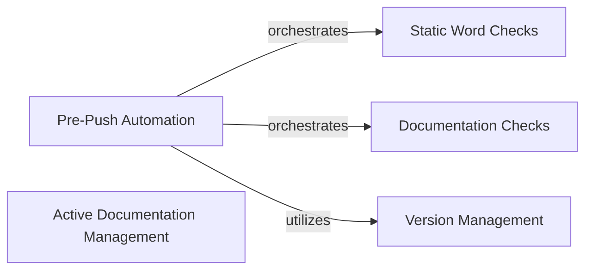

## Component Details

This component comprises scripts and utilities primarily used for the development, testing, and release management of the PRAW library itself. It includes tools for static analysis, unit testing, and version control, and is not part of the library's runtime functionality.

### Pre-Push Automation
This component automates pre-push checks, including running static analysis (pre-commit, sphinx-build) and unit tests (pytest). It orchestrates the execution of these checks and reports their success or failure.

**Related Classes/Methods**:

- <a href="https://github.com/praw-dev/praw/blob/master/pre_push.py#L2-L80" target="_blank" rel="noopener noreferrer">`praw.pre_push` (2:80)</a>
- <a href="https://github.com/praw-dev/praw/blob/master/pre_push.py#L58-L98" target="_blank" rel="noopener noreferrer">`praw.pre_push.main` (58:98)</a>
- <a href="https://github.com/praw-dev/praw/blob/master/pre_push.py#L32-L45" target="_blank" rel="noopener noreferrer">`praw.pre_push.run_static` (32:45)</a>
- <a href="https://github.com/praw-dev/praw/blob/master/pre_push.py#L48-L55" target="_blank" rel="noopener noreferrer">`praw.pre_push.run_unit` (48:55)</a>
- <a href="https://github.com/praw-dev/praw/blob/master/pre_push.py#L10-L29" target="_blank" rel="noopener noreferrer">`praw.pre_push.do_process` (10:29)</a>

### Static Word Checks
This component is responsible for performing static analysis on the codebase, specifically checking for double syntax and 'noreturn' patterns within the code. It uses a dedicated checker class to encapsulate this logic.

**Related Classes/Methods**:

- <a href="https://github.com/praw-dev/praw/blob/master/tools/static_word_checks.py#L5-L100" target="_blank" rel="noopener noreferrer">`praw.tools.static_word_checks` (5:100)</a>
- <a href="https://github.com/praw-dev/praw/blob/master/tools/static_word_checks.py#L120-L140" target="_blank" rel="noopener noreferrer">`praw.tools.static_word_checks.main` (120:140)</a>
- <a href="https://github.com/praw-dev/praw/blob/master/tools/static_word_checks.py#L8-L117" target="_blank" rel="noopener noreferrer">`praw.tools.static_word_checks.StaticChecker` (8:117)</a>
- <a href="https://github.com/praw-dev/praw/blob/master/tools/static_word_checks.py#L75-L117" target="_blank" rel="noopener noreferrer">`praw.tools.static_word_checks.StaticChecker.run_checks` (75:117)</a>
- <a href="https://github.com/praw-dev/praw/blob/master/tools/static_word_checks.py#L27-L55" target="_blank" rel="noopener noreferrer">`praw.tools.static_word_checks.StaticChecker.check_for_double_syntax` (27:55)</a>
- <a href="https://github.com/praw-dev/praw/blob/master/tools/static_word_checks.py#L57-L73" target="_blank" rel="noopener noreferrer">`praw.tools.static_word_checks.StaticChecker.check_for_noreturn` (57:73)</a>

### Documentation Checks
This component focuses on verifying the documentation, particularly by discovering and checking subclasses for proper documentation. It ensures consistency and completeness of the project's documentation.

**Related Classes/Methods**:

- <a href="https://github.com/praw-dev/praw/blob/master/tools/check_documentation.py#L5-L70" target="_blank" rel="noopener noreferrer">`praw.tools.check_documentation` (5:70)</a>
- <a href="https://github.com/praw-dev/praw/blob/master/tools/check_documentation.py#L80-L81" target="_blank" rel="noopener noreferrer">`praw.tools.check_documentation.main` (80:81)</a>
- <a href="https://github.com/praw-dev/praw/blob/master/tools/check_documentation.py#L16-L77" target="_blank" rel="noopener noreferrer">`praw.tools.check_documentation.DocumentationChecker` (16:77)</a>
- <a href="https://github.com/praw-dev/praw/blob/master/tools/check_documentation.py#L46-L77" target="_blank" rel="noopener noreferrer">`praw.tools.check_documentation.DocumentationChecker.check` (46:77)</a>
- <a href="https://github.com/praw-dev/praw/blob/master/tools/check_documentation.py#L36-L43" target="_blank" rel="noopener noreferrer">`praw.tools.check_documentation.DocumentationChecker.discover_subclasses` (36:43)</a>

### Active Documentation Management
This component manages the active documentation versions, primarily by fetching available versions. It likely supports processes related to deploying or updating documentation.

**Related Classes/Methods**:

- <a href="https://github.com/praw-dev/praw/blob/master/tools/set_active_docs.py#L5-L80" target="_blank" rel="noopener noreferrer">`praw.tools.set_active_docs` (5:80)</a>
- <a href="https://github.com/praw-dev/praw/blob/master/tools/set_active_docs.py#L32-L90" target="_blank" rel="noopener noreferrer">`praw.tools.set_active_docs.main` (32:90)</a>
- <a href="https://github.com/praw-dev/praw/blob/master/tools/set_active_docs.py#L14-L29" target="_blank" rel="noopener noreferrer">`praw.tools.set_active_docs.fetch_versions` (14:29)</a>

### Version Management
This component handles the project's versioning, including managing unreleased changes, updating the changelog, incrementing development versions, and updating package version information. It ensures proper version control and release preparation.

**Related Classes/Methods**:

- <a href="https://github.com/praw-dev/praw/blob/master/tools/set_version.py#L5-L100" target="_blank" rel="noopener noreferrer">`praw.tools.set_version` (5:100)</a>
- <a href="https://github.com/praw-dev/praw/blob/master/tools/set_version.py#L64-L70" target="_blank" rel="noopener noreferrer">`praw.tools.set_version.main` (64:70)</a>
- <a href="https://github.com/praw-dev/praw/blob/master/tools/set_version.py#L32-L33" target="_blank" rel="noopener noreferrer">`praw.tools.set_version.handle_unreleased` (32:33)</a>
- <a href="https://github.com/praw-dev/praw/blob/master/tools/set_version.py#L36-L40" target="_blank" rel="noopener noreferrer">`praw.tools.set_version.handle_version` (36:40)</a>
- <a href="https://github.com/praw-dev/praw/blob/master/tools/set_version.py#L15-L29" target="_blank" rel="noopener noreferrer">`praw.tools.set_version.add_unreleased_to_changelog` (15:29)</a>
- <a href="https://github.com/praw-dev/praw/blob/master/tools/set_version.py#L43-L61" target="_blank" rel="noopener noreferrer">`praw.tools.set_version.increment_development_version` (43:61)</a>
- <a href="https://github.com/praw-dev/praw/blob/master/tools/set_version.py#L107-L112" target="_blank" rel="noopener noreferrer">`praw.tools.set_version.valid_version` (107:112)</a>
- <a href="https://github.com/praw-dev/praw/blob/master/tools/set_version.py#L73-L88" target="_blank" rel="noopener noreferrer">`praw.tools.set_version.update_changelog` (73:88)</a>
- <a href="https://github.com/praw-dev/praw/blob/master/tools/set_version.py#L91-L104" target="_blank" rel="noopener noreferrer">`praw.tools.set_version.update_package` (91:104)</a>

### [FAQ](https://github.com/CodeBoarding/GeneratedOnBoardings/tree/main?tab=readme-ov-file#faq)