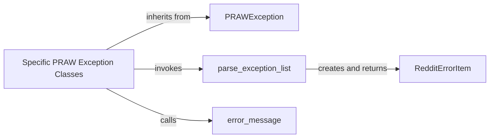

## Details

The `Exception Handling` subsystem is encapsulated within the `praw.exceptions` module, primarily defined by the `praw/praw/exceptions.py` file. It provides a dedicated mechanism for handling and representing errors specific to the PRAW library and the Reddit API.

### PRAWException
The foundational base class for all custom exceptions within the PRAW library. It ensures a consistent interface and common attributes for all PRAW-specific errors, acting as the root of the exception hierarchy.

**Related Classes/Methods**:

- <a href="https://github.com/CodeBoarding/praw/blob/main/praw/exceptions.py#L14-L15" target="_blank" rel="noopener noreferrer">`PRAWException`:14-15</a>

### Specific PRAW Exception Classes
A set of specialized exception classes (e.g., `APIException`, `ClientException`) that inherit from `PRAWException`. These classes represent distinct error conditions, such as those returned by the Reddit API or client-side operational failures, and encapsulate parsed error details for specific contexts.

**Related Classes/Methods**:

- <a href="https://github.com/CodeBoarding/praw/blob/main/praw/exceptions.py#L170-L201" target="_blank" rel="noopener noreferrer">`APIException`:170-201</a>
- <a href="https://github.com/CodeBoarding/praw/blob/main/praw/exceptions.py#L74-L75" target="_blank" rel="noopener noreferrer">`ClientException`:74-75</a>

### RedditErrorItem
A lightweight data structure that encapsulates the details of a single error item. It stores parsed information such as the error message, associated field, and type, as extracted from raw API responses.

**Related Classes/Methods**:

- <a href="https://github.com/CodeBoarding/praw/blob/main/praw/exceptions.py#L18-L71" target="_blank" rel="noopener noreferrer">`RedditErrorItem`:18-71</a>

### parse_exception_list
A utility function responsible for processing raw error data, typically a list of error messages or codes received from Reddit API responses. It transforms this raw data into a structured collection of `RedditErrorItem` objects.

**Related Classes/Methods**:

- <a href="https://github.com/CodeBoarding/praw/blob/main/praw/exceptions.py#L173-L189" target="_blank" rel="noopener noreferrer">`parse_exception_list`:173-189</a>

### error_message
A utility function dedicated to formatting a list of `RedditErrorItem` objects into a concise and informative error string. This string is suitable for display to developers or for logging purposes.

**Related Classes/Methods**:

- <a href="https://github.com/CodeBoarding/praw/blob/main/praw/exceptions.py#L21-L29" target="_blank" rel="noopener noreferrer">`error_message`:21-29</a>

### [FAQ](https://github.com/CodeBoarding/GeneratedOnBoardings/tree/main?tab=readme-ov-file#faq)
