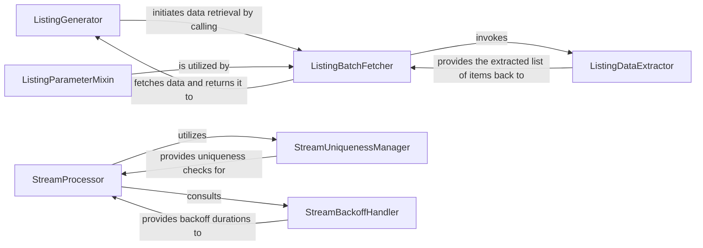

## Details

This subsystem is responsible for abstracting the complexities of consuming data from the Reddit API, specifically handling paginated "listings" (e.g., posts in a subreddit) and continuous "streams" of new data (e.g., new comments). It ensures efficient data retrieval, manages pagination state, handles item uniqueness in streams, and implements robust backoff strategies to respect API rate limits.

### ListingGenerator
Provides an iterable interface for consuming paginated API responses. It manages the state of pagination, such as the `_after` parameter, to fetch subsequent batches of data seamlessly.

**Related Classes/Methods**:

- <a href="https://github.com/CodeBoarding/praw/blob/main/praw/models/listing/generator.py#L17-L103" target="_blank" rel="noopener noreferrer">`ListingGenerator`:17-103</a>

### ListingBatchFetcher
Responsible for fetching a single batch of items from the Reddit API using the underlying `Reddit` client. It utilizes the pagination state provided by `ListingGenerator` to request the correct segment of data.

**Related Classes/Methods**:

- <a href="https://github.com/CodeBoarding/praw/blob/main/praw/models/listing/generator.py#L1-L1000" target="_blank" rel="noopener noreferrer">`ListingBatchFetcher`:1-1000</a>

### ListingDataExtractor
Parses the raw JSON response received from the API, isolating and returning the actual list of data objects (e.g., posts, comments) from the API's wrapper structure.

**Related Classes/Methods**:

- <a href="https://github.com/CodeBoarding/praw/blob/main/praw/models/listing/generator.py#L1-L1000" target="_blank" rel="noopener noreferrer">`ListingDataExtractor`:1-1000</a>

### ListingParameterMixin
Provides common methods for constructing API paths and parameters required for various types of listings. This ensures consistency and reusability across different listing endpoints.

**Related Classes/Methods**:

- <a href="https://github.com/CodeBoarding/praw/blob/main/praw/models/listing/mixins/base.py#L1-L1000" target="_blank" rel="noopener noreferrer">`ListingParameterMixin`:1-1000</a>

### StreamProcessor
Implements the foundational logic for consuming continuous data streams from the Reddit API. It manages the overall flow, including delays between requests and ensuring resilient fetching.

**Related Classes/Methods**:

- <a href="https://github.com/CodeBoarding/praw/blob/main/praw/models/util.py#L1-L1000" target="_blank" rel="noopener noreferrer">`StreamProcessor`:1-1000</a>

### StreamUniquenessManager
Maintains a limited set of recently seen items to ensure uniqueness within a data stream. This prevents reprocessing of duplicate items, which is crucial for real-time data consumption.

**Related Classes/Methods**:

- <a href="https://github.com/CodeBoarding/praw/blob/main/praw/models/util.py#L1-L1000" target="_blank" rel="noopener noreferrer">`StreamUniquenessManager`:1-1000</a>

### StreamBackoffHandler
Implements an exponential backoff strategy to manage delays between stream requests. This is critical for respecting API rate limits and preventing excessive requests that could lead to temporary bans.

**Related Classes/Methods**:

- <a href="https://github.com/CodeBoarding/praw/blob/main/praw/models/util.py#L1-L1000" target="_blank" rel="noopener noreferrer">`StreamBackoffHandler`:1-1000</a>

### [FAQ](https://github.com/CodeBoarding/GeneratedOnBoardings/tree/main?tab=readme-ov-file#faq)
