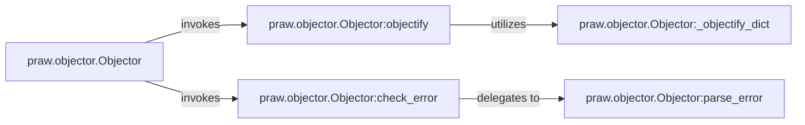

## Details

The `praw.objector` subsystem is designed to seamlessly convert raw data from the Reddit API into usable PRAW objects while providing robust error handling. The `Objector` class serves as the central entry point, orchestrating the objectification and error-checking processes. The `objectify` method, with the assistance of `_objectify_dict`, recursively transforms complex data structures into their corresponding PRAW object representations. Concurrently, the `check_error` method, by delegating to `parse_error`, ensures that any API-reported errors are properly identified and converted into structured exceptions, maintaining the integrity and reliability of the data processing pipeline. This clear separation of concerns between data transformation and error management allows for a modular and maintainable architecture.

### praw.objector.Objector
The central orchestrator of the transformation process, converting raw JSON responses into structured Python objects and managing error detection. It acts as the primary interface for the objectification process.

**Related Classes/Methods**:

- <a href="https://github.com/CodeBoarding/praw/blob/main/praw/objector.py#L17-L263" target="_blank" rel="noopener noreferrer">`praw.objector.Objector`:17-263</a>

### praw.objector.Objector:objectify
Implements the core recursive logic for data transformation, traversing raw JSON data, identifying appropriate PRAW object types, and instantiating them. This method is the heart of the data mapping functionality.

**Related Classes/Methods**:

- <a href="https://github.com/CodeBoarding/praw/blob/main/praw/objector.py#L199-L279" target="_blank" rel="noopener noreferrer">`praw.objector.Objector:objectify`:199-279</a>

### praw.objector.Objector:_objectify_dict
A specialized helper method for `objectify`, focusing on converting individual dictionary elements within the raw data into their corresponding PRAW object representations. It handles the granular conversion of data structures.

**Related Classes/Methods**:

- <a href="https://github.com/CodeBoarding/praw/blob/main/praw/objector.py#L46-L197" target="_blank" rel="noopener noreferrer">`praw.objector.Objector:_objectify_dict`:46-197</a>

### praw.objector.Objector:check_error
Responsible for scanning API responses for error indicators and delegating to `parse_error` if an error is detected. This ensures robust error handling within the transformation pipeline.

**Related Classes/Methods**:

- <a href="https://github.com/CodeBoarding/praw/blob/main/praw/objector.py#L6-L11" target="_blank" rel="noopener noreferrer">`praw.objector.Objector:check_error`:6-11</a>

### praw.objector.Objector:parse_error
Interprets raw error data from the API response, converting it into a structured format or raising a specific exception relevant to the PRAW library. This component standardizes error reporting.

**Related Classes/Methods**:

- <a href="https://github.com/CodeBoarding/praw/blob/main/praw/objector.py#L13-L44" target="_blank" rel="noopener noreferrer">`praw.objector.Objector:parse_error`:13-44</a>

### [FAQ](https://github.com/CodeBoarding/GeneratedOnBoardings/tree/main?tab=readme-ov-file#faq)
