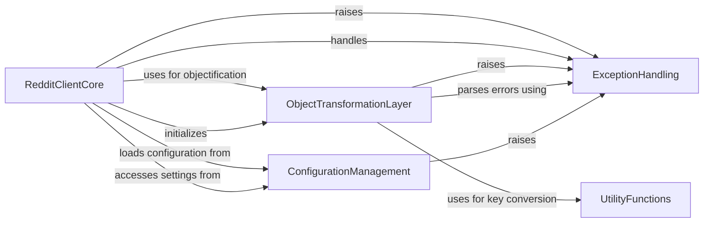

## Component Details

This graph represents the core interaction layer of the PRAW library with the Reddit API. The main flow involves the `RedditClientCore` initiating API requests, which are then processed by the `ObjectTransformationLayer` to convert raw responses into structured Python objects. `ConfigurationManagement` provides necessary settings for the client, while `ExceptionHandling` ensures robust error management across these interactions. `UtilityFunctions` support various operations, including data transformation for consistency.

### RedditClientCore
This component serves as the central interface for interacting with the Reddit API. It manages the lifecycle of API interactions, including initialization, authentication, and dispatching various types of HTTP requests (GET, POST, PUT, DELETE, PATCH). It also integrates with other components to handle objectification of responses, rate limiting, and update checks, providing a comprehensive entry point for PRAW users.

**Related Classes/Methods**:

- <a href="https://github.com/praw-dev/praw/blob/master/praw/reddit.py#L57-L901" target="_blank" rel="noopener noreferrer">`praw.praw.reddit.Reddit` (57:901)</a>
- <a href="https://github.com/praw-dev/praw/blob/master/praw/reddit.py#L87-L89" target="_blank" rel="noopener noreferrer">`praw.praw.reddit.Reddit:read_only` (87:89)</a>
- <a href="https://github.com/praw-dev/praw/blob/master/praw/reddit.py#L114-L386" target="_blank" rel="noopener noreferrer">`praw.praw.reddit.Reddit:__init__` (114:386)</a>
- <a href="https://github.com/praw-dev/praw/blob/master/praw/reddit.py#L435-L469" target="_blank" rel="noopener noreferrer">`praw.praw.reddit.Reddit:_objectify_request` (435:469)</a>
- <a href="https://github.com/praw-dev/praw/blob/master/praw/reddit.py#L479-L525" target="_blank" rel="noopener noreferrer">`praw.praw.reddit.Reddit:_prepare_objector` (479:525)</a>
- <a href="https://github.com/praw-dev/praw/blob/master/praw/reddit.py#L527-L546" target="_blank" rel="noopener noreferrer">`praw.praw.reddit.Reddit:_prepare_prawcore` (527:546)</a>
- <a href="https://github.com/praw-dev/praw/blob/master/praw/reddit.py#L548-L564" target="_blank" rel="noopener noreferrer">`praw.praw.reddit.Reddit:_prepare_trusted_prawcore` (548:564)</a>
- <a href="https://github.com/praw-dev/praw/blob/master/praw/reddit.py#L566-L570" target="_blank" rel="noopener noreferrer">`praw.praw.reddit.Reddit:_prepare_untrusted_prawcore` (566:570)</a>
- <a href="https://github.com/praw-dev/praw/blob/master/praw/reddit.py#L572-L580" target="_blank" rel="noopener noreferrer">`praw.praw.reddit.Reddit:_resolve_share_url` (572:580)</a>
- <a href="https://github.com/praw-dev/praw/blob/master/praw/reddit.py#L582-L596" target="_blank" rel="noopener noreferrer">`praw.praw.reddit.Reddit:comment` (582:596)</a>
- <a href="https://github.com/praw-dev/praw/blob/master/praw/reddit.py#L598-L617" target="_blank" rel="noopener noreferrer">`praw.praw.reddit.Reddit:delete` (598:617)</a>
- <a href="https://github.com/praw-dev/praw/blob/master/praw/reddit.py#L619-L625" target="_blank" rel="noopener noreferrer">`praw.praw.reddit.Reddit:domain` (619:625)</a>
- <a href="https://github.com/praw-dev/praw/blob/master/praw/reddit.py#L627-L639" target="_blank" rel="noopener noreferrer">`praw.praw.reddit.Reddit:get` (627:639)</a>
- <a href="https://github.com/praw-dev/praw/blob/master/praw/reddit.py#L641-L720" target="_blank" rel="noopener noreferrer">`praw.praw.reddit.Reddit:info` (641:720)</a>
- <a href="https://github.com/praw-dev/praw/blob/master/praw/reddit.py#L722-L741" target="_blank" rel="noopener noreferrer">`praw.praw.reddit.Reddit:patch` (722:741)</a>
- <a href="https://github.com/praw-dev/praw/blob/master/praw/reddit.py#L743-L789" target="_blank" rel="noopener noreferrer">`praw.praw.reddit.Reddit:post` (743:789)</a>
- <a href="https://github.com/praw-dev/praw/blob/master/praw/reddit.py#L791-L808" target="_blank" rel="noopener noreferrer">`praw.praw.reddit.Reddit:put` (791:808)</a>
- <a href="https://github.com/praw-dev/praw/blob/master/praw/reddit.py#L810-L819" target="_blank" rel="noopener noreferrer">`praw.praw.reddit.Reddit:redditor` (810:819)</a>
- <a href="https://github.com/praw-dev/praw/blob/master/praw/reddit.py#L821-L876" target="_blank" rel="noopener noreferrer">`praw.praw.reddit.Reddit:request` (821:876)</a>
- <a href="https://github.com/praw-dev/praw/blob/master/praw/reddit.py#L878-L889" target="_blank" rel="noopener noreferrer">`praw.praw.reddit.Reddit:submission` (878:889)</a>
- <a href="https://github.com/praw-dev/praw/blob/master/praw/reddit.py#L891-L901" target="_blank" rel="noopener noreferrer">`praw.praw.reddit.Reddit:username_available` (891:901)</a>
- <a href="https://github.com/praw-dev/praw/blob/master/praw/reddit.py#L413-L418" target="_blank" rel="noopener noreferrer">`praw.praw.reddit.Reddit._check_for_update` (413:418)</a>
- <a href="https://github.com/praw-dev/praw/blob/master/praw/reddit.py#L388-L411" target="_blank" rel="noopener noreferrer">`praw.praw.reddit.Reddit._check_for_async` (388:411)</a>
- <a href="https://github.com/praw-dev/praw/blob/master/praw/reddit.py#L420-L433" target="_blank" rel="noopener noreferrer">`praw.praw.reddit.Reddit._handle_rate_limit` (420:433)</a>
- <a href="https://github.com/praw-dev/praw/blob/master/praw/reddit.py#L471-L477" target="_blank" rel="noopener noreferrer">`praw.praw.reddit.Reddit._prepare_common_authorizer` (471:477)</a>
- <a href="https://github.com/praw-dev/praw/blob/master/praw/models/auth.py#L11-L125" target="_blank" rel="noopener noreferrer">`praw.models.auth.Auth` (11:125)</a>
- <a href="https://github.com/praw-dev/praw/blob/master/praw/models/helpers.py#L20-L133" target="_blank" rel="noopener noreferrer">`praw.models.helpers.DraftHelper` (20:133)</a>
- <a href="https://github.com/praw-dev/praw/blob/master/praw/models/front.py#L17-L32" target="_blank" rel="noopener noreferrer">`praw.models.front.Front` (17:32)</a>
- <a href="https://github.com/praw-dev/praw/blob/master/praw/models/inbox.py#L18-L324" target="_blank" rel="noopener noreferrer">`praw.models.inbox.Inbox` (18:324)</a>
- <a href="https://github.com/praw-dev/praw/blob/master/praw/models/helpers.py#L136-L238" target="_blank" rel="noopener noreferrer">`praw.models.helpers.LiveHelper` (136:238)</a>
- <a href="https://github.com/praw-dev/praw/blob/master/praw/models/helpers.py#L241-L298" target="_blank" rel="noopener noreferrer">`praw.models.helpers.MultiredditHelper` (241:298)</a>
- <a href="https://github.com/praw-dev/praw/blob/master/praw/models/mod_notes.py#L466-L682" target="_blank" rel="noopener noreferrer">`praw.models.mod_notes.RedditModNotes` (466:682)</a>
- <a href="https://github.com/praw-dev/praw/blob/master/praw/models/redditors.py#L26-L104" target="_blank" rel="noopener noreferrer">`praw.models.redditors.Redditors` (26:104)</a>
- <a href="https://github.com/praw-dev/praw/blob/master/praw/models/helpers.py#L301-L353" target="_blank" rel="noopener noreferrer">`praw.models.helpers.SubredditHelper` (301:353)</a>
- <a href="https://github.com/praw-dev/praw/blob/master/praw/models/subreddits.py#L19-L133" target="_blank" rel="noopener noreferrer">`praw.models.subreddits.Subreddits` (19:133)</a>
- <a href="https://github.com/praw-dev/praw/blob/master/praw/models/user.py#L24-L259" target="_blank" rel="noopener noreferrer">`praw.models.user.User` (24:259)</a>
- <a href="https://github.com/praw-dev/praw/blob/master/praw/models/reddit/comment.py#L19-L311" target="_blank" rel="noopener noreferrer">`praw.models.reddit.comment.Comment` (19:311)</a>
- <a href="https://github.com/praw-dev/praw/blob/master/praw/models/listing/domain.py#L14-L25" target="_blank" rel="noopener noreferrer">`praw.models.listing.domain.DomainListing` (14:25)</a>
- <a href="https://github.com/praw-dev/praw/blob/master/praw/models/reddit/redditor.py#L21-L409" target="_blank" rel="noopener noreferrer">`praw.models.reddit.redditor.Redditor` (21:409)</a>
- <a href="https://github.com/praw-dev/praw/blob/master/praw/models/reddit/submission.py#L395-L916" target="_blank" rel="noopener noreferrer">`praw.models.reddit.submission.Submission` (395:916)</a>

### ObjectTransformationLayer
This component is responsible for transforming raw JSON responses received from the Reddit API into structured Python objects that PRAW users can easily interact with. It also includes functionality for parsing and handling API-specific errors embedded within the responses and converting dictionary keys from camelCase to snake_case for Pythonic consistency.

**Related Classes/Methods**:

- <a href="https://github.com/praw-dev/praw/blob/master/praw/objector.py#L17-L263" target="_blank" rel="noopener noreferrer">`praw.praw.objector.Objector` (17:263)</a>
- <a href="https://github.com/praw-dev/praw/blob/master/praw/objector.py#L21-L24" target="_blank" rel="noopener noreferrer">`praw.praw.objector.Objector:check_error` (21:24)</a>
- <a href="https://github.com/praw-dev/praw/blob/master/praw/objector.py#L27-L48" target="_blank" rel="noopener noreferrer">`praw.praw.objector.Objector:parse_error` (27:48)</a>
- <a href="https://github.com/praw-dev/praw/blob/master/praw/objector.py#L59-L201" target="_blank" rel="noopener noreferrer">`praw.praw.objector.Objector:_objectify_dict` (59:201)</a>
- <a href="https://github.com/praw-dev/praw/blob/master/praw/objector.py#L203-L263" target="_blank" rel="noopener noreferrer">`praw.praw.objector.Objector:objectify` (203:263)</a>

### ConfigurationManagement
This component is dedicated to loading, managing, and providing access to PRAW's configuration settings. It supports reading configurations from various sources, such as a 'praw.ini' file or environment variables, ensuring that the Reddit client is properly configured with necessary credentials and API parameters.

**Related Classes/Methods**:

- <a href="https://github.com/praw-dev/praw/blob/master/praw/config.py#L27-L173" target="_blank" rel="noopener noreferrer">`praw.praw.config.Config` (27:173)</a>
- <a href="https://github.com/praw-dev/praw/blob/master/praw/config.py#L74-L83" target="_blank" rel="noopener noreferrer">`praw.praw.config.Config:short_url` (74:83)</a>
- <a href="https://github.com/praw-dev/praw/blob/master/praw/config.py#L85-L103" target="_blank" rel="noopener noreferrer">`praw.praw.config.Config:__init__` (85:103)</a>
- <a href="https://github.com/praw-dev/praw/blob/master/praw/config.py#L110-L113" target="_blank" rel="noopener noreferrer">`praw.praw.config.Config:_fetch_default` (110:113)</a>
- <a href="https://github.com/praw-dev/praw/blob/master/praw/config.py#L115-L123" target="_blank" rel="noopener noreferrer">`praw.praw.config.Config:_fetch_or_not_set` (115:123)</a>
- <a href="https://github.com/praw-dev/praw/blob/master/praw/config.py#L125-L173" target="_blank" rel="noopener noreferrer">`praw.praw.config.Config:_initialize_attributes` (125:173)</a>
- <a href="https://github.com/praw-dev/praw/blob/master/praw/config.py#L45-L71" target="_blank" rel="noopener noreferrer">`praw.praw.config.Config:_load_config` (45:71)</a>
- <a href="https://github.com/praw-dev/praw/blob/master/praw/config.py#L39-L42" target="_blank" rel="noopener noreferrer">`praw.praw.config.Config:_config_boolean` (39:42)</a>
- <a href="https://github.com/praw-dev/praw/blob/master/praw/config.py#L105-L108" target="_blank" rel="noopener noreferrer">`praw.praw.config.Config:_fetch` (105:108)</a>

### ExceptionHandling
This component centralizes the definition and management of custom exceptions within PRAW. It provides a structured way to handle various error conditions, including client-side issues, Reddit API errors, and specific operational failures like media post failures or missing attributes, ensuring robust error reporting and recovery.

**Related Classes/Methods**:

- <a href="https://github.com/praw-dev/praw/blob/master/praw/exceptions.py#L158-L167" target="_blank" rel="noopener noreferrer">`praw.praw.exceptions.MediaPostFailed` (158:167)</a>
- <a href="https://github.com/praw-dev/praw/blob/master/praw/exceptions.py#L170-L201" target="_blank" rel="noopener noreferrer">`praw.praw.exceptions.RedditAPIException` (170:201)</a>
- <a href="https://github.com/praw-dev/praw/blob/master/praw/exceptions.py#L74-L75" target="_blank" rel="noopener noreferrer">`praw.praw.exceptions.ClientException` (74:75)</a>
- <a href="https://github.com/praw-dev/praw/blob/master/praw/exceptions.py#L121-L122" target="_blank" rel="noopener noreferrer">`praw.praw.exceptions.MissingRequiredAttributeException` (121:122)</a>
- <a href="https://github.com/praw-dev/praw/blob/master/praw/exceptions.py#L174-L189" target="_blank" rel="noopener noreferrer">`praw.praw.exceptions.RedditAPIException:parse_exception_list` (174:189)</a>
- <a href="https://github.com/praw-dev/praw/blob/master/praw/exceptions.py#L191-L201" target="_blank" rel="noopener noreferrer">`praw.praw.exceptions.RedditAPIException:__init__` (191:201)</a>
- <a href="https://github.com/praw-dev/praw/blob/master/praw/exceptions.py#L18-L71" target="_blank" rel="noopener noreferrer">`praw.praw.exceptions.RedditErrorItem` (18:71)</a>
- <a href="https://github.com/praw-dev/praw/blob/master/praw/exceptions.py#L161-L167" target="_blank" rel="noopener noreferrer">`praw.praw.exceptions.MediaPostFailed:__init__` (161:167)</a>
- <a href="https://github.com/praw-dev/praw/blob/master/praw/exceptions.py#L149-L155" target="_blank" rel="noopener noreferrer">`praw.praw.exceptions.WebSocketException.__init__` (149:155)</a>

### UtilityFunctions
This component provides a collection of general-purpose utility functions that support various operations within PRAW. Specifically, it includes functions for string manipulation, such as converting dictionary keys from camelCase to snake_case, which is crucial for maintaining consistent naming conventions across the library's object model.

**Related Classes/Methods**:

- <a href="https://github.com/praw-dev/praw/blob/master/praw/util/snake.py#L6-L19" target="_blank" rel="noopener noreferrer">`praw.praw.util.snake` (6:19)</a>
- <a href="https://github.com/praw-dev/praw/blob/master/praw/util/snake.py#L16-L22" target="_blank" rel="noopener noreferrer">`praw.praw.util.snake:snake_case_keys` (16:22)</a>
- <a href="https://github.com/praw-dev/praw/blob/master/praw/util/snake.py#L11-L13" target="_blank" rel="noopener noreferrer">`praw.praw.util.snake:camel_to_snake` (11:13)</a>

### [FAQ](https://github.com/CodeBoarding/GeneratedOnBoardings/tree/main?tab=readme-ov-file#faq)