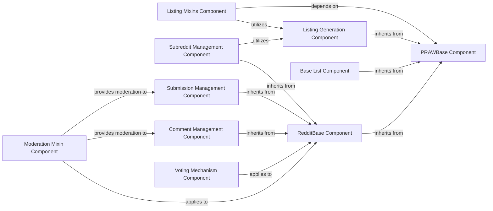

## Component Details

This graph provides an overview of the Reddit Data Models subsystem in PRAW, which defines the foundational structure and common behaviors for various Reddit entities. It illustrates how core base classes like PRAWBase and RedditBase establish the blueprint for data representation, while specialized components manage specific Reddit objects such as subreddits, comments, and submissions. Mixin components integrate common functionalities like voting, moderation, and listing generation across different data models, ensuring consistent interaction with the Reddit API and efficient data handling.

### PRAWBase Component
This component serves as the foundational superclass for all models within the PRAW library. It provides core utilities such as safely adding arguments to dictionaries and a class method for parsing data into PRAWBase instances. It initializes instances with a Reddit object and optional initial data.

**Related Classes/Methods**:

- <a href="https://github.com/praw-dev/praw/blob/master/praw/models/base.py#L12-L47" target="_blank" rel="noopener noreferrer">`praw.models.base.PRAWBase` (12:47)</a>
- <a href="https://github.com/praw-dev/praw/blob/master/praw/models/base.py#L16-L26" target="_blank" rel="noopener noreferrer">`praw.models.base.PRAWBase._safely_add_arguments` (16:26)</a>
- <a href="https://github.com/praw-dev/praw/blob/master/praw/models/base.py#L29-L36" target="_blank" rel="noopener noreferrer">`praw.models.base.PRAWBase.parse` (29:36)</a>
- <a href="https://github.com/praw-dev/praw/blob/master/praw/models/base.py#L38-L47" target="_blank" rel="noopener noreferrer">`praw.models.base.PRAWBase.__init__` (38:47)</a>

### RedditBase Component
Building upon PRAWBase, this component represents actual Reddit objects. It includes functionalities for parsing URLs, handling attribute access (fetching data if not already fetched), and defining equality/hashing for Reddit objects. It also provides methods for fetching data from the Reddit API and resetting attributes.

**Related Classes/Methods**:

- <a href="https://github.com/praw-dev/praw/blob/master/praw/models/reddit/base.py#L16-L90" target="_blank" rel="noopener noreferrer">`praw.models.reddit.base.RedditBase` (16:90)</a>
- <a href="https://github.com/praw-dev/praw/blob/master/praw/models/reddit/base.py#L20-L24" target="_blank" rel="noopener noreferrer">`praw.models.reddit.base.RedditBase._url_parts` (20:24)</a>
- <a href="https://github.com/praw-dev/praw/blob/master/praw/models/reddit/base.py#L32-L38" target="_blank" rel="noopener noreferrer">`praw.models.reddit.base.RedditBase.__getattr__` (32:38)</a>
- <a href="https://github.com/praw-dev/praw/blob/master/praw/models/reddit/base.py#L44-L64" target="_blank" rel="noopener noreferrer">`praw.models.reddit.base.RedditBase.__init__` (44:64)</a>
- <a href="https://github.com/praw-dev/praw/blob/master/praw/models/reddit/base.py#L78-L79" target="_blank" rel="noopener noreferrer">`praw.models.reddit.base.RedditBase._fetch` (78:79)</a>
- <a href="https://github.com/praw-dev/praw/blob/master/praw/models/reddit/base.py#L81-L84" target="_blank" rel="noopener noreferrer">`praw.models.reddit.base.RedditBase._fetch_data` (81:84)</a>
- <a href="https://github.com/praw-dev/praw/blob/master/praw/models/reddit/base.py#L86-L90" target="_blank" rel="noopener noreferrer">`praw.models.reddit.base.RedditBase._reset_attributes` (86:90)</a>

### Listing Generation Component
This component is responsible for generating and iterating through various Reddit listings, such as comments, submissions, or other content. It manages the fetching of batches of items from the Reddit API and handles pagination to provide a continuous stream of content.

**Related Classes/Methods**:

- <a href="https://github.com/praw-dev/praw/blob/master/praw/models/listing/generator.py#L17-L103" target="_blank" rel="noopener noreferrer">`praw.models.listing.generator.ListingGenerator` (17:103)</a>
- <a href="https://github.com/praw-dev/praw/blob/master/praw/models/listing/generator.py#L29-L56" target="_blank" rel="noopener noreferrer">`praw.models.listing.generator.ListingGenerator.__init__` (29:56)</a>
- <a href="https://github.com/praw-dev/praw/blob/master/praw/models/listing/generator.py#L58-L60" target="_blank" rel="noopener noreferrer">`praw.models.listing.generator.ListingGenerator.__iter__` (58:60)</a>
- <a href="https://github.com/praw-dev/praw/blob/master/praw/models/listing/generator.py#L62-L73" target="_blank" rel="noopener noreferrer">`praw.models.listing.generator.ListingGenerator.__next__` (62:73)</a>
- <a href="https://github.com/praw-dev/praw/blob/master/praw/models/listing/generator.py#L75-L87" target="_blank" rel="noopener noreferrer">`praw.models.listing.generator.ListingGenerator._extract_sublist` (75:87)</a>
- <a href="https://github.com/praw-dev/praw/blob/master/praw/models/listing/generator.py#L89-L103" target="_blank" rel="noopener noreferrer">`praw.models.listing.generator.ListingGenerator._next_batch` (89:103)</a>

### Listing Mixins Component
This component provides a set of mixin classes that add common listing functionalities to various Reddit objects. It includes methods for retrieving controversial, hot, new, and top items, with support for time filters and argument preparation for API requests.

**Related Classes/Methods**:

- <a href="https://github.com/praw-dev/praw/blob/master/praw/models/listing/mixins/base.py#L15-L149" target="_blank" rel="noopener noreferrer">`praw.models.listing.mixins.base.BaseListingMixin` (15:149)</a>
- <a href="https://github.com/praw-dev/praw/blob/master/praw/models/listing/mixins/base.py#L21-L30" target="_blank" rel="noopener noreferrer">`praw.models.listing.mixins.base.BaseListingMixin._validate_time_filter` (21:30)</a>
- <a href="https://github.com/praw-dev/praw/blob/master/praw/models/listing/mixins/base.py#L32-L37" target="_blank" rel="noopener noreferrer">`praw.models.listing.mixins.base.BaseListingMixin._prepare` (32:37)</a>
- <a href="https://github.com/praw-dev/praw/blob/master/praw/models/listing/mixins/base.py#L39-L72" target="_blank" rel="noopener noreferrer">`praw.models.listing.mixins.base.BaseListingMixin.controversial` (39:72)</a>
- <a href="https://github.com/praw-dev/praw/blob/master/praw/models/listing/mixins/base.py#L74-L94" target="_blank" rel="noopener noreferrer">`praw.models.listing.mixins.base.BaseListingMixin.hot` (74:94)</a>
- <a href="https://github.com/praw-dev/praw/blob/master/praw/models/listing/mixins/base.py#L96-L116" target="_blank" rel="noopener noreferrer">`praw.models.listing.mixins.base.BaseListingMixin.new` (96:116)</a>
- <a href="https://github.com/praw-dev/praw/blob/master/praw/models/listing/mixins/base.py#L118-L149" target="_blank" rel="noopener noreferrer">`praw.models.listing.mixins.base.BaseListingMixin.top` (118:149)</a>

### Subreddit Management Component
This component encapsulates functionalities related to managing subreddits, including retrieving subreddit information, moderating content, and handling subreddit-specific streams like comments and submissions. It also provides methods for managing subreddit relationships and stylesheets.

**Related Classes/Methods**:

- `praw.models.reddit.subreddit.Subreddit` (full file reference)
- `praw.models.reddit.subreddit.Subreddit.__init__` (full file reference)
- `praw.models.reddit.subreddit.Subreddit._fetch` (full file reference)
- `praw.models.reddit.subreddit.Subreddit.search` (full file reference)
- `praw.models.reddit.subreddit.SubredditModeration.log` (full file reference)
- `praw.models.reddit.subreddit.SubredditModeration.unmoderated` (full file reference)
- `praw.models.reddit.subreddit.SubredditStream.comments` (full file reference)
- `praw.models.reddit.subreddit.SubredditStream.submissions` (full file reference)

### Comment Management Component
This component handles operations related to Reddit comments. It provides methods for initializing comment instances, extracting comment IDs from URLs, accessing comment replies, and refreshing comment attributes. It also includes moderation functionalities specific to comments.

**Related Classes/Methods**:

- <a href="https://github.com/praw-dev/praw/blob/master/praw/models/reddit/comment.py#L19-L311" target="_blank" rel="noopener noreferrer">`praw.models.reddit.comment.Comment` (19:311)</a>
- <a href="https://github.com/praw-dev/praw/blob/master/praw/models/reddit/comment.py#L64-L74" target="_blank" rel="noopener noreferrer">`praw.models.reddit.comment.Comment.id_from_url` (64:74)</a>
- <a href="https://github.com/praw-dev/praw/blob/master/praw/models/reddit/comment.py#L143-L163" target="_blank" rel="noopener noreferrer">`praw.models.reddit.comment.Comment.__init__` (143:163)</a>
- <a href="https://github.com/praw-dev/praw/blob/master/praw/models/reddit/comment.py#L185-L196" target="_blank" rel="noopener noreferrer">`praw.models.reddit.comment.Comment._fetch` (185:196)</a>
- <a href="https://github.com/praw-dev/praw/blob/master/praw/models/reddit/comment.py#L201-L262" target="_blank" rel="noopener noreferrer">`praw.models.reddit.comment.Comment.parent` (201:262)</a>
- <a href="https://github.com/praw-dev/praw/blob/master/praw/models/reddit/comment.py#L264-L311" target="_blank" rel="noopener noreferrer">`praw.models.reddit.comment.Comment.refresh` (264:311)</a>
- <a href="https://github.com/praw-dev/praw/blob/master/praw/models/reddit/comment.py#L336-L350" target="_blank" rel="noopener noreferrer">`praw.models.reddit.comment.CommentModeration.show` (336:350)</a>

### Submission Management Component
This component manages Reddit submissions, providing functionalities for creating, retrieving, and moderating submissions. It includes methods for handling submission flair, setting contest mode, marking content as NSFW or spoiler, and managing sticky posts.

**Related Classes/Methods**:

- <a href="https://github.com/praw-dev/praw/blob/master/praw/models/reddit/submission.py#L395-L916" target="_blank" rel="noopener noreferrer">`praw.models.reddit.submission.Submission` (395:916)</a>
- <a href="https://github.com/praw-dev/praw/blob/master/praw/models/reddit/submission.py#L452-L483" target="_blank" rel="noopener noreferrer">`praw.models.reddit.submission.Submission.id_from_url` (452:483)</a>
- <a href="https://github.com/praw-dev/praw/blob/master/praw/models/reddit/submission.py#L566-L598" target="_blank" rel="noopener noreferrer">`praw.models.reddit.submission.Submission.__init__` (566:598)</a>
- <a href="https://github.com/praw-dev/praw/blob/master/praw/models/reddit/submission.py#L710-L723" target="_blank" rel="noopener noreferrer">`praw.models.reddit.submission.Submission._fetch` (710:723)</a>
- <a href="https://github.com/praw-dev/praw/blob/master/praw/models/reddit/submission.py#L115-L137" target="_blank" rel="noopener noreferrer">`praw.models.reddit.submission.SubmissionModeration.contest_mode` (115:137)</a>
- <a href="https://github.com/praw-dev/praw/blob/master/praw/models/reddit/submission.py#L139-L174" target="_blank" rel="noopener noreferrer">`praw.models.reddit.submission.SubmissionModeration.flair` (139:174)</a>
- <a href="https://github.com/praw-dev/praw/blob/master/praw/models/reddit/submission.py#L176-L194" target="_blank" rel="noopener noreferrer">`praw.models.reddit.submission.SubmissionModeration.nsfw` (176:194)</a>
- <a href="https://github.com/praw-dev/praw/blob/master/praw/models/reddit/submission.py#L244-L262" target="_blank" rel="noopener noreferrer">`praw.models.reddit.submission.SubmissionModeration.spoiler` (244:262)</a>
- <a href="https://github.com/praw-dev/praw/blob/master/praw/models/reddit/submission.py#L264-L297" target="_blank" rel="noopener noreferrer">`praw.models.reddit.submission.SubmissionModeration.sticky` (264:297)</a>

### Voting Mechanism Component
This component provides the core functionality for users to interact with the voting system on Reddit content. It allows for upvoting, downvoting, and clearing votes on various votable objects like submissions and comments.

**Related Classes/Methods**:

- <a href="https://github.com/praw-dev/praw/blob/master/praw/models/reddit/mixins/votable.py#L8-L92" target="_blank" rel="noopener noreferrer">`praw.models.reddit.mixins.votable.VotableMixin` (8:92)</a>
- <a href="https://github.com/praw-dev/praw/blob/master/praw/models/reddit/mixins/votable.py#L11-L12" target="_blank" rel="noopener noreferrer">`praw.models.reddit.mixins.votable.VotableMixin._vote` (11:12)</a>
- <a href="https://github.com/praw-dev/praw/blob/master/praw/models/reddit/mixins/votable.py#L14-L36" target="_blank" rel="noopener noreferrer">`praw.models.reddit.mixins.votable.VotableMixin.clear_vote` (14:36)</a>
- <a href="https://github.com/praw-dev/praw/blob/master/praw/models/reddit/mixins/votable.py#L38-L64" target="_blank" rel="noopener noreferrer">`praw.models.reddit.mixins.votable.VotableMixin.downvote` (38:64)</a>
- <a href="https://github.com/praw-dev/praw/blob/master/praw/models/reddit/mixins/votable.py#L66-L92" target="_blank" rel="noopener noreferrer">`praw.models.reddit.mixins.votable.VotableMixin.upvote` (66:92)</a>

### Moderation Mixin Component
This component provides a set of common moderation functionalities that can be applied to various 'Thing' objects (like comments and submissions) on Reddit. It includes methods for removing content and distinguishing posts.

**Related Classes/Methods**:

- `praw.models.reddit.mixins.thing_moderation.ThingModerationMixin` (10:120)
- `praw.models.reddit.mixins.thing_moderation.ThingModerationMixin.remove` (full file reference)
- `praw.models.reddit.mixins.thing_moderation.ThingModerationMixin.undistinguish` (full file reference)

### Base List Component
This component provides the foundational structure for various list-like objects within PRAW, such as lists of drafts, moderated items, redditors, or trophies. It extends `PRAWBase` to offer common functionalities for managing collections of Reddit entities.

**Related Classes/Methods**:

- <a href="https://github.com/praw-dev/praw/blob/master/praw/models/list/base.py#L15-L54" target="_blank" rel="noopener noreferrer">`praw.models.list.base.BaseList` (15:54)</a>

### [FAQ](https://github.com/CodeBoarding/GeneratedOnBoardings/tree/main?tab=readme-ov-file#faq)