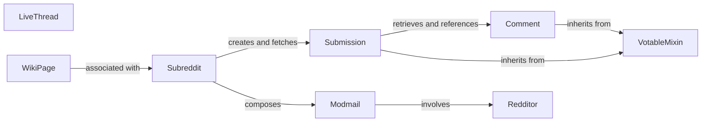

## Details

The PRAW library's core architecture for interacting with Reddit content is centered around key models representing Reddit entities. The Subreddit component acts as a central hub for community-specific interactions, enabling the creation and retrieval of Submission objects. Submission objects, in turn, manage post data and facilitate interactions with Comment threads. Both Submission and Comment leverage the VotableMixin for consistent voting functionality, demonstrating effective code reuse through inheritance. User-centric operations are handled by the Redditor component, which is involved in Modmail conversations. Modmail itself is composed by Subreddit, indicating its role in community moderation. LiveThread and WikiPage represent distinct content streams and informational pages, with WikiPage being directly associated with a Subreddit. This design emphasizes a clear separation of concerns, with each component encapsulating specific Reddit functionality and interacting through well-defined relationships to manage and present Reddit data.

### Subreddit
Manages subreddit data, submissions, moderation, flair, and style. It acts as a primary facade for subreddit-specific API calls, allowing users to interact with a community's content and settings.

**Related Classes/Methods**:

- <a href="https://github.com/CodeBoarding/praw/blob/main/praw/models/reddit/subreddit.py" target="_blank" rel="noopener noreferrer">`praw.models.reddit.subreddit.Subreddit`</a>

### Submission
Encapsulates Reddit post data, including content, flair, and moderation status. It provides methods for retrieving content and interacting with the post (e.g., voting, commenting).

**Related Classes/Methods**:

- <a href="https://github.com/CodeBoarding/praw/blob/main/praw/models/reddit/submission.py" target="_blank" rel="noopener noreferrer">`praw.models.reddit.submission.Submission`</a>

### Comment
Manages individual comment data, including its content, author, and hierarchical position within a discussion. It provides methods for moderation and navigating comment threads.

**Related Classes/Methods**:

- <a href="https://github.com/CodeBoarding/praw/blob/main/praw/reddit.py#L582-L596" target="_blank" rel="noopener noreferrer">`Comment`:582-596</a>

### Redditor
Provides access to user-specific information, including profile details, submitted content, and comments. It enables interactions related to a specific Reddit user.

**Related Classes/Methods**:

- <a href="https://github.com/CodeBoarding/praw/blob/main/praw/reddit.py#L810-L819" target="_blank" rel="noopener noreferrer">`Redditor`:810-819</a>

### VotableMixin
A mixin class that provides common voting functionality (upvote, downvote, clear vote) to any Reddit entity that can be voted on. This promotes code reuse and consistency across votable models.

**Related Classes/Methods**:

- <a href="https://github.com/CodeBoarding/praw/blob/main/praw/models/reddit/mixins/votable.py#L8-L92" target="_blank" rel="noopener noreferrer">`VotableMixin`:8-92</a>

### Modmail
Represents a modmail conversation, facilitating communication between moderators and users, or between moderators themselves. It encapsulates messages and conversation states.

**Related Classes/Methods**:

- <a href="https://github.com/CodeBoarding/praw/blob/main/praw/models/reddit/subreddit.py#L2627-L2639" target="_blank" rel="noopener noreferrer">`Modmail`:2627-2639</a>

### LiveThread
Manages data and interactions for Reddit Live Threads, which are real-time, event-driven content streams. It provides access to updates and thread metadata.

**Related Classes/Methods**:

- <a href="https://github.com/CodeBoarding/praw/blob/main/praw/models/reddit/live.py#L261-L471" target="_blank" rel="noopener noreferrer">`LiveThread`:261-471</a>

### WikiPage
Abstracts the content and moderation aspects of a Reddit Wiki Page. It allows for retrieval, editing, and management of wiki content within a subreddit.

**Related Classes/Methods**:

- <a href="https://github.com/CodeBoarding/praw/blob/main/praw/models/reddit/wikipage.py#L146-L314" target="_blank" rel="noopener noreferrer">`WikiPage`:146-314</a>

### [FAQ](https://github.com/CodeBoarding/GeneratedOnBoardings/tree/main?tab=readme-ov-file#faq)
