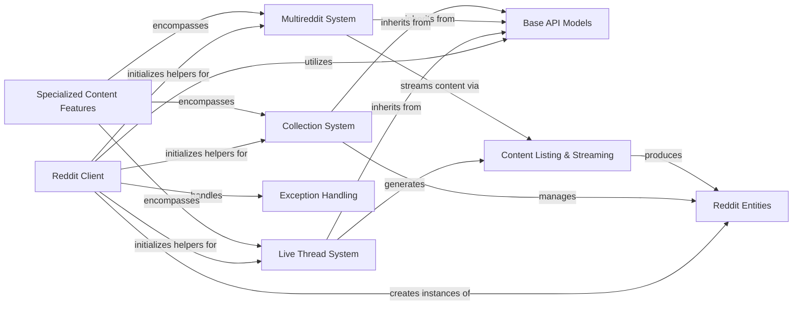

## Component Details

This graph illustrates the architecture of the PRAW library, focusing on how it manages various Reddit functionalities. The core `Reddit Client` component acts as the central entry point, handling API interactions and initializing helpers for specialized content types. These specialized content types, including `Live Thread System`, `Multireddit System`, and `Collection System`, are encapsulated within the `Specialized Content Features` component, providing dedicated interfaces for their unique structures and functionalities. All these systems leverage `Base API Models` for fundamental operations and interact with `Reddit Entities` to represent core Reddit objects. `Content Listing & Streaming` provides mechanisms for iterating and streaming data, while `Exception Handling` ensures robust error management across the library.

### Reddit Client
The central class for interacting with the Reddit API, responsible for initialization, configuration, request handling, and providing access to various Reddit entities.

**Related Classes/Methods**:

- <a href="https://github.com/praw-dev/praw/blob/master/praw/reddit.py#L57-L901" target="_blank" rel="noopener noreferrer">`praw.reddit.Reddit` (57:901)</a>
- <a href="https://github.com/praw-dev/praw/blob/master/praw/reddit.py#L114-L386" target="_blank" rel="noopener noreferrer">`praw.reddit.Reddit.__init__` (114:386)</a>
- <a href="https://github.com/praw-dev/praw/blob/master/praw/reddit.py#L435-L469" target="_blank" rel="noopener noreferrer">`praw.reddit.Reddit._objectify_request` (435:469)</a>
- <a href="https://github.com/praw-dev/praw/blob/master/praw/reddit.py#L821-L876" target="_blank" rel="noopener noreferrer">`praw.reddit.Reddit.request` (821:876)</a>
- <a href="https://github.com/praw-dev/praw/blob/master/praw/reddit.py#L641-L720" target="_blank" rel="noopener noreferrer">`praw.reddit.Reddit.info` (641:720)</a>
- <a href="https://github.com/praw-dev/praw/blob/master/praw/reddit.py#L743-L789" target="_blank" rel="noopener noreferrer">`praw.reddit.Reddit.post` (743:789)</a>
- <a href="https://github.com/praw-dev/praw/blob/master/praw/reddit.py#L627-L639" target="_blank" rel="noopener noreferrer">`praw.reddit.Reddit.get` (627:639)</a>
- <a href="https://github.com/praw-dev/praw/blob/master/praw/reddit.py#L598-L617" target="_blank" rel="noopener noreferrer">`praw.reddit.Reddit.delete` (598:617)</a>
- <a href="https://github.com/praw-dev/praw/blob/master/praw/reddit.py#L722-L741" target="_blank" rel="noopener noreferrer">`praw.reddit.Reddit.patch` (722:741)</a>
- <a href="https://github.com/praw-dev/praw/blob/master/praw/reddit.py#L791-L808" target="_blank" rel="noopener noreferrer">`praw.reddit.Reddit.put` (791:808)</a>
- <a href="https://github.com/praw-dev/praw/blob/master/praw/reddit.py#L582-L596" target="_blank" rel="noopener noreferrer">`praw.reddit.Reddit.comment` (582:596)</a>
- <a href="https://github.com/praw-dev/praw/blob/master/praw/reddit.py#L619-L625" target="_blank" rel="noopener noreferrer">`praw.reddit.Reddit.domain` (619:625)</a>
- <a href="https://github.com/praw-dev/praw/blob/master/praw/reddit.py#L810-L819" target="_blank" rel="noopener noreferrer">`praw.reddit.Reddit.redditor` (810:819)</a>
- <a href="https://github.com/praw-dev/praw/blob/master/praw/reddit.py#L878-L889" target="_blank" rel="noopener noreferrer">`praw.reddit.Reddit.submission` (878:889)</a>
- <a href="https://github.com/praw-dev/praw/blob/master/praw/reddit.py#L891-L901" target="_blank" rel="noopener noreferrer">`praw.reddit.Reddit.username_available` (891:901)</a>

### Live Thread System
This system encompasses all functionalities related to Reddit Live Threads, including their creation, retrieval, updates, contributor management, and streaming of live content.

**Related Classes/Methods**:

- <a href="https://github.com/praw-dev/praw/blob/master/praw/models/helpers.py#L136-L238" target="_blank" rel="noopener noreferrer">`praw.models.helpers.LiveHelper` (136:238)</a>
- <a href="https://github.com/praw-dev/praw/blob/master/praw/models/helpers.py#L139-L151" target="_blank" rel="noopener noreferrer">`praw.models.helpers.LiveHelper.__call__` (139:151)</a>
- <a href="https://github.com/praw-dev/praw/blob/master/praw/models/helpers.py#L183-L223" target="_blank" rel="noopener noreferrer">`praw.models.helpers.LiveHelper.info` (183:223)</a>
- <a href="https://github.com/praw-dev/praw/blob/master/praw/models/reddit/live.py#L261-L471" target="_blank" rel="noopener noreferrer">`praw.models.reddit.live.LiveThread` (261:471)</a>
- <a href="https://github.com/praw-dev/praw/blob/master/praw/models/reddit/live.py#L375-L392" target="_blank" rel="noopener noreferrer">`praw.models.reddit.live.LiveThread.__init__` (375:392)</a>
- <a href="https://github.com/praw-dev/praw/blob/master/praw/models/reddit/live.py#L394-L399" target="_blank" rel="noopener noreferrer">`praw.models.reddit.live.LiveThread._fetch` (394:399)</a>
- <a href="https://github.com/praw-dev/praw/blob/master/praw/models/reddit/live.py#L284-L295" target="_blank" rel="noopener noreferrer">`praw.models.reddit.live.LiveThread.contrib` (284:295)</a>
- <a href="https://github.com/praw-dev/praw/blob/master/praw/models/reddit/live.py#L298-L313" target="_blank" rel="noopener noreferrer">`praw.models.reddit.live.LiveThread.contributor` (298:313)</a>
- <a href="https://github.com/praw-dev/praw/blob/master/praw/models/reddit/live.py#L316-L338" target="_blank" rel="noopener noreferrer">`praw.models.reddit.live.LiveThread.stream` (316:338)</a>
- <a href="https://github.com/praw-dev/praw/blob/master/praw/models/reddit/live.py#L352-L369" target="_blank" rel="noopener noreferrer">`praw.models.reddit.live.LiveThread.__getitem__` (352:369)</a>
- <a href="https://github.com/praw-dev/praw/blob/master/praw/models/reddit/live.py#L404-L426" target="_blank" rel="noopener noreferrer">`praw.models.reddit.live.LiveThread.discussions` (404:426)</a>
- <a href="https://github.com/praw-dev/praw/blob/master/praw/models/reddit/live.py#L446-L471" target="_blank" rel="noopener noreferrer">`praw.models.reddit.live.LiveThread.updates` (446:471)</a>
- <a href="https://github.com/praw-dev/praw/blob/master/praw/models/reddit/live.py#L22-L258" target="_blank" rel="noopener noreferrer">`praw.models.reddit.live.LiveContributorRelationship` (22:258)</a>
- <a href="https://github.com/praw-dev/praw/blob/master/praw/models/reddit/live.py#L73-L111" target="_blank" rel="noopener noreferrer">`praw.models.reddit.live.LiveContributorRelationship.invite` (73:111)</a>
- <a href="https://github.com/praw-dev/praw/blob/master/praw/models/reddit/live.py#L174-L215" target="_blank" rel="noopener noreferrer">`praw.models.reddit.live.LiveContributorRelationship.update` (174:215)</a>
- <a href="https://github.com/praw-dev/praw/blob/master/praw/models/reddit/live.py#L217-L258" target="_blank" rel="noopener noreferrer">`praw.models.reddit.live.LiveContributorRelationship.update_invite` (217:258)</a>
- <a href="https://github.com/praw-dev/praw/blob/master/praw/models/reddit/live.py#L474-L582" target="_blank" rel="noopener noreferrer">`praw.models.reddit.live.LiveThreadContribution` (474:582)</a>
- <a href="https://github.com/praw-dev/praw/blob/master/praw/models/reddit/live.py#L523-L582" target="_blank" rel="noopener noreferrer">`praw.models.reddit.live.LiveThreadContribution.update` (523:582)</a>
- <a href="https://github.com/praw-dev/praw/blob/master/praw/models/reddit/live.py#L700-L792" target="_blank" rel="noopener noreferrer">`praw.models.reddit.live.LiveUpdate` (700:792)</a>
- <a href="https://github.com/praw-dev/praw/blob/master/praw/models/reddit/live.py#L743-L780" target="_blank" rel="noopener noreferrer">`praw.models.reddit.live.LiveUpdate.__init__` (743:780)</a>
- <a href="https://github.com/praw-dev/praw/blob/master/praw/models/reddit/live.py#L788-L792" target="_blank" rel="noopener noreferrer">`praw.models.reddit.live.LiveUpdate._fetch` (788:792)</a>
- <a href="https://github.com/praw-dev/praw/blob/master/praw/models/reddit/live.py#L724-L736" target="_blank" rel="noopener noreferrer">`praw.models.reddit.live.LiveUpdate.contrib` (724:736)</a>
- <a href="https://github.com/praw-dev/praw/blob/master/praw/models/reddit/live.py#L782-L786" target="_blank" rel="noopener noreferrer">`praw.models.reddit.live.LiveUpdate.__setattr__` (782:786)</a>
- <a href="https://github.com/praw-dev/praw/blob/master/praw/models/reddit/live.py#L585-L637" target="_blank" rel="noopener noreferrer">`praw.models.reddit.live.LiveThreadStream` (585:637)</a>
- <a href="https://github.com/praw-dev/praw/blob/master/praw/models/reddit/live.py#L605-L637" target="_blank" rel="noopener noreferrer">`praw.models.reddit.live.LiveThreadStream.updates` (605:637)</a>

### Multireddit System
This system manages Reddit Multireddits, providing functionalities for creating, modifying, and retrieving multireddit content, as well as streaming from them.

**Related Classes/Methods**:

- <a href="https://github.com/praw-dev/praw/blob/master/praw/models/helpers.py#L241-L298" target="_blank" rel="noopener noreferrer">`praw.models.helpers.MultiredditHelper` (241:298)</a>
- <a href="https://github.com/praw-dev/praw/blob/master/praw/models/helpers.py#L244-L253" target="_blank" rel="noopener noreferrer">`praw.models.helpers.MultiredditHelper.__call__` (244:253)</a>
- <a href="https://github.com/praw-dev/praw/blob/master/praw/models/reddit/multi.py#L20-L228" target="_blank" rel="noopener noreferrer">`praw.models.reddit.multi.Multireddit` (20:228)</a>
- <a href="https://github.com/praw-dev/praw/blob/master/praw/models/reddit/multi.py#L96-L104" target="_blank" rel="noopener noreferrer">`praw.models.reddit.multi.Multireddit.__init__` (96:104)</a>
- <a href="https://github.com/praw-dev/praw/blob/master/praw/models/reddit/multi.py#L106-L111" target="_blank" rel="noopener noreferrer">`praw.models.reddit.multi.Multireddit._fetch` (106:111)</a>
- <a href="https://github.com/praw-dev/praw/blob/master/praw/models/reddit/multi.py#L120-L135" target="_blank" rel="noopener noreferrer">`praw.models.reddit.multi.Multireddit.add` (120:135)</a>
- <a href="https://github.com/praw-dev/praw/blob/master/praw/models/reddit/multi.py#L137-L161" target="_blank" rel="noopener noreferrer">`praw.models.reddit.multi.Multireddit.copy` (137:161)</a>
- <a href="https://github.com/praw-dev/praw/blob/master/praw/models/reddit/multi.py#L176-L191" target="_blank" rel="noopener noreferrer">`praw.models.reddit.multi.Multireddit.remove` (176:191)</a>
- <a href="https://github.com/praw-dev/praw/blob/master/praw/models/reddit/multi.py#L72-L94" target="_blank" rel="noopener noreferrer">`praw.models.reddit.multi.Multireddit.stream` (72:94)</a>
- <a href="https://github.com/praw-dev/praw/blob/master/praw/models/reddit/multi.py#L55-L69" target="_blank" rel="noopener noreferrer">`praw.models.reddit.multi.Multireddit.sluggify` (55:69)</a>

### Collection System
This system handles Reddit Collections, including their creation, content management, and moderation functionalities.

**Related Classes/Methods**:

- <a href="https://github.com/praw-dev/praw/blob/master/praw/models/reddit/collections.py#L380-L575" target="_blank" rel="noopener noreferrer">`praw.models.reddit.collections.Collection` (380:575)</a>
- <a href="https://github.com/praw-dev/praw/blob/master/praw/models/reddit/collections.py#L454-L484" target="_blank" rel="noopener noreferrer">`praw.models.reddit.collections.Collection.__init__` (454:484)</a>
- <a href="https://github.com/praw-dev/praw/blob/master/praw/models/reddit/collections.py#L521-L534" target="_blank" rel="noopener noreferrer">`praw.models.reddit.collections.Collection._fetch` (521:534)</a>
- <a href="https://github.com/praw-dev/praw/blob/master/praw/models/reddit/collections.py#L422-L438" target="_blank" rel="noopener noreferrer">`praw.models.reddit.collections.Collection.mod` (422:438)</a>
- <a href="https://github.com/praw-dev/praw/blob/master/praw/models/reddit/collections.py#L291-L377" target="_blank" rel="noopener noreferrer">`praw.models.reddit.collections.SubredditCollections` (291:377)</a>
- <a href="https://github.com/praw-dev/praw/blob/master/praw/models/reddit/collections.py#L352-L360" target="_blank" rel="noopener noreferrer">`praw.models.reddit.collections.SubredditCollections.__init__` (352:360)</a>
- <a href="https://github.com/praw-dev/praw/blob/master/praw/models/reddit/collections.py#L316-L350" target="_blank" rel="noopener noreferrer">`praw.models.reddit.collections.SubredditCollections.__call__` (316:350)</a>
- <a href="https://github.com/praw-dev/praw/blob/master/praw/models/reddit/collections.py#L303-L314" target="_blank" rel="noopener noreferrer">`praw.models.reddit.collections.SubredditCollections.mod` (303:314)</a>
- <a href="https://github.com/praw-dev/praw/blob/master/praw/models/reddit/collections.py#L21-L216" target="_blank" rel="noopener noreferrer">`praw.models.reddit.collections.CollectionModeration` (21:216)</a>
- <a href="https://github.com/praw-dev/praw/blob/master/praw/models/reddit/collections.py#L32-L39" target="_blank" rel="noopener noreferrer">`praw.models.reddit.collections.CollectionModeration.__init__` (32:39)</a>
- <a href="https://github.com/praw-dev/praw/blob/master/praw/models/reddit/collections.py#L61-L84" target="_blank" rel="noopener noreferrer">`praw.models.reddit.collections.CollectionModeration.add_post` (61:84)</a>
- <a href="https://github.com/praw-dev/praw/blob/master/praw/models/reddit/collections.py#L102-L125" target="_blank" rel="noopener noreferrer">`praw.models.reddit.collections.CollectionModeration.remove_post` (102:125)</a>
- <a href="https://github.com/praw-dev/praw/blob/master/praw/models/reddit/collections.py#L127-L147" target="_blank" rel="noopener noreferrer">`praw.models.reddit.collections.CollectionModeration.reorder` (127:147)</a>
- <a href="https://github.com/praw-dev/praw/blob/master/praw/models/reddit/collections.py#L41-L59" target="_blank" rel="noopener noreferrer">`praw.models.reddit.collections.CollectionModeration._post_fullname` (41:59)</a>
- <a href="https://github.com/praw-dev/praw/blob/master/praw/models/reddit/collections.py#L219-L288" target="_blank" rel="noopener noreferrer">`praw.models.reddit.collections.SubredditCollectionsModeration` (219:288)</a>
- <a href="https://github.com/praw-dev/praw/blob/master/praw/models/reddit/collections.py#L230-L238" target="_blank" rel="noopener noreferrer">`praw.models.reddit.collections.SubredditCollectionsModeration.__init__` (230:238)</a>

### Base API Models
This component provides the fundamental building blocks and common methods for various PRAW models, such as base initialization, URL parsing, and generic data fetching mechanisms.

**Related Classes/Methods**:

- <a href="https://github.com/praw-dev/praw/blob/master/praw/models/base.py#L12-L47" target="_blank" rel="noopener noreferrer">`praw.models.base.PRAWBase` (12:47)</a>
- <a href="https://github.com/praw-dev/praw/blob/master/praw/models/base.py#L38-L47" target="_blank" rel="noopener noreferrer">`praw.models.base.PRAWBase.__init__` (38:47)</a>
- <a href="https://github.com/praw-dev/praw/blob/master/praw/models/reddit/base.py#L16-L90" target="_blank" rel="noopener noreferrer">`praw.models.reddit.base.RedditBase` (16:90)</a>
- <a href="https://github.com/praw-dev/praw/blob/master/praw/models/reddit/base.py#L44-L64" target="_blank" rel="noopener noreferrer">`praw.models.reddit.base.RedditBase.__init__` (44:64)</a>
- <a href="https://github.com/praw-dev/praw/blob/master/praw/models/reddit/base.py#L20-L24" target="_blank" rel="noopener noreferrer">`praw.models.reddit.base.RedditBase._url_parts` (20:24)</a>
- <a href="https://github.com/praw-dev/praw/blob/master/praw/models/reddit/base.py#L81-L84" target="_blank" rel="noopener noreferrer">`praw.models.reddit.base.RedditBase._fetch_data` (81:84)</a>
- <a href="https://github.com/praw-dev/praw/blob/master/praw/models/reddit/base.py#L78-L79" target="_blank" rel="noopener noreferrer">`praw.models.reddit.base.RedditBase._fetch` (78:79)</a>
- <a href="https://github.com/praw-dev/praw/blob/master/praw/models/reddit/base.py#L86-L90" target="_blank" rel="noopener noreferrer">`praw.models.reddit.base.RedditBase._reset_attributes` (86:90)</a>
- <a href="https://github.com/praw-dev/praw/blob/master/praw/models/listing/mixins/subreddit.py#L49-L73" target="_blank" rel="noopener noreferrer">`praw.models.listing.mixins.subreddit.SubredditListingMixin` (49:73)</a>
- <a href="https://github.com/praw-dev/praw/blob/master/praw/models/listing/mixins/subreddit.py#L67-L73" target="_blank" rel="noopener noreferrer">`praw.models.listing.mixins.subreddit.SubredditListingMixin.__init__` (67:73)</a>

### Content Listing & Streaming
This component is responsible for generating iterable listings of Reddit content and providing mechanisms for streaming real-time data from various sources.

**Related Classes/Methods**:

- <a href="https://github.com/praw-dev/praw/blob/master/praw/models/listing/generator.py#L17-L103" target="_blank" rel="noopener noreferrer">`praw.models.listing.generator.ListingGenerator` (17:103)</a>
- <a href="https://github.com/praw-dev/praw/blob/master/praw/models/util.py#L36-L163" target="_blank" rel="noopener noreferrer">`praw.models.util.stream_generator` (36:163)</a>
- `praw.models.reddit.subreddit.SubredditStream` (full file reference)

### Reddit Entities
This component represents core Reddit entities such as Redditors (users) and Subreddits, encapsulating their properties and providing methods for interaction.

**Related Classes/Methods**:

- <a href="https://github.com/praw-dev/praw/blob/master/praw/models/reddit/redditor.py#L21-L409" target="_blank" rel="noopener noreferrer">`praw.models.reddit.redditor.Redditor` (21:409)</a>
- `praw.models.reddit.subreddit.Subreddit` (full file reference)

### Exception Handling
This component defines and manages custom exceptions specific to the PRAW library, allowing for structured error handling within the application.

**Related Classes/Methods**:

- <a href="https://github.com/praw-dev/praw/blob/master/praw/exceptions.py#L74-L75" target="_blank" rel="noopener noreferrer">`praw.exceptions.ClientException` (74:75)</a>

### Specialized Content Features
Manages specialized content types on Reddit, including Live Threads, Multireddits, and Collections. It provides dedicated interfaces for interacting with these unique content structures and their specific functionalities.

**Related Classes/Methods**:

- <a href="https://github.com/praw-dev/praw/blob/master/praw/models/helpers.py#L136-L238" target="_blank" rel="noopener noreferrer">`praw.models.helpers.LiveHelper` (136:238)</a>
- <a href="https://github.com/praw-dev/praw/blob/master/praw/models/reddit/live.py#L22-L258" target="_blank" rel="noopener noreferrer">`praw.models.reddit.live.LiveContributorRelationship` (22:258)</a>
- <a href="https://github.com/praw-dev/praw/blob/master/praw/models/reddit/live.py#L261-L471" target="_blank" rel="noopener noreferrer">`praw.models.reddit.live.LiveThread` (261:471)</a>
- <a href="https://github.com/praw-dev/praw/blob/master/praw/models/reddit/live.py#L474-L582" target="_blank" rel="noopener noreferrer">`praw.models.reddit.live.LiveThreadContribution` (474:582)</a>
- <a href="https://github.com/praw-dev/praw/blob/master/praw/models/reddit/live.py#L585-L637" target="_blank" rel="noopener noreferrer">`praw.models.reddit.live.LiveThreadStream` (585:637)</a>
- <a href="https://github.com/praw-dev/praw/blob/master/praw/models/reddit/live.py#L700-L792" target="_blank" rel="noopener noreferrer">`praw.models.reddit.live.LiveUpdate` (700:792)</a>
- <a href="https://github.com/praw-dev/praw/blob/master/praw/models/reddit/live.py#L640-L697" target="_blank" rel="noopener noreferrer">`praw.models.reddit.live.LiveUpdateContribution` (640:697)</a>
- <a href="https://github.com/praw-dev/praw/blob/master/praw/models/helpers.py#L241-L298" target="_blank" rel="noopener noreferrer">`praw.models.helpers.MultiredditHelper` (241:298)</a>
- <a href="https://github.com/praw-dev/praw/blob/master/praw/models/reddit/multi.py#L20-L228" target="_blank" rel="noopener noreferrer">`praw.models.reddit.multi.Multireddit` (20:228)</a>
- <a href="https://github.com/praw-dev/praw/blob/master/praw/models/reddit/collections.py#L21-L216" target="_blank" rel="noopener noreferrer">`praw.models.reddit.collections.CollectionModeration` (21:216)</a>
- <a href="https://github.com/praw-dev/praw/blob/master/praw/models/reddit/collections.py#L219-L288" target="_blank" rel="noopener noreferrer">`praw.models.reddit.collections.SubredditCollectionsModeration` (219:288)</a>
- <a href="https://github.com/praw-dev/praw/blob/master/praw/models/reddit/collections.py#L291-L377" target="_blank" rel="noopener noreferrer">`praw.models.reddit.collections.SubredditCollections` (291:377)</a>
- <a href="https://github.com/praw-dev/praw/blob/master/praw/models/reddit/collections.py#L380-L575" target="_blank" rel="noopener noreferrer">`praw.models.reddit.collections.Collection` (380:575)</a>

### [FAQ](https://github.com/CodeBoarding/GeneratedOnBoardings/tree/main?tab=readme-ov-file#faq)