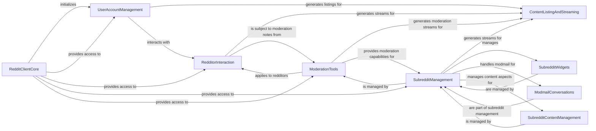

## Component Details

This comprehensive component provides all tools necessary for managing user accounts, interacting with individual Redditor profiles, and moderating subreddits. It covers user preferences, inbox management, subreddit creation, moderation tools (modmail, notes, rules, removal reasons, wiki pages, widgets, emojis), and relationships within communities.

### RedditClientCore
This component serves as the primary interface for interacting with the Reddit API, initializing core functionalities and providing access points to various Reddit resources.

**Related Classes/Methods**:

- <a href="https://github.com/praw-dev/praw/blob/master/praw/reddit.py#L57-L901" target="_blank" rel="noopener noreferrer">`praw.reddit.Reddit` (57:901)</a>
- <a href="https://github.com/praw-dev/praw/blob/master/praw/models/front.py#L17-L32" target="_blank" rel="noopener noreferrer">`praw.praw.models.front.Front` (17:32)</a>
- <a href="https://github.com/praw-dev/praw/blob/master/praw/models/auth.py#L11-L125" target="_blank" rel="noopener noreferrer">`praw.praw.models.auth.Auth` (11:125)</a>

### UserAccountManagement
This component handles functionalities related to the authenticated user's account, including managing inbox messages, user preferences, and retrieving information about the user's contributions and moderation roles.

**Related Classes/Methods**:

- <a href="https://github.com/praw-dev/praw/blob/master/praw/models/inbox.py#L18-L324" target="_blank" rel="noopener noreferrer">`praw.praw.models.inbox.Inbox` (18:324)</a>
- <a href="https://github.com/praw-dev/praw/blob/master/praw/models/user.py#L24-L259" target="_blank" rel="noopener noreferrer">`praw.praw.models.user.User` (24:259)</a>
- <a href="https://github.com/praw-dev/praw/blob/master/praw/models/preferences.py#L14-L204" target="_blank" rel="noopener noreferrer">`praw.models.preferences.Preferences` (14:204)</a>

### RedditorInteraction
This component provides methods for interacting with individual Reddit users (Redditors), such as retrieving user profiles, managing friendships, and accessing user-specific content streams.

**Related Classes/Methods**:

- <a href="https://github.com/praw-dev/praw/blob/master/praw/models/redditors.py#L26-L104" target="_blank" rel="noopener noreferrer">`praw.praw.models.redditors.Redditors` (26:104)</a>
- <a href="https://github.com/praw-dev/praw/blob/master/praw/models/reddit/redditor.py#L21-L409" target="_blank" rel="noopener noreferrer">`praw.praw.models.reddit.redditor.Redditor` (21:409)</a>
- <a href="https://github.com/praw-dev/praw/blob/master/praw/models/reddit/redditor.py#L412-L457" target="_blank" rel="noopener noreferrer">`praw.praw.models.reddit.redditor.RedditorStream` (412:457)</a>
- <a href="https://github.com/praw-dev/praw/blob/master/praw/models/reddit/user_subreddit.py#L14-L78" target="_blank" rel="noopener noreferrer">`praw.praw.models.reddit.user_subreddit.UserSubreddit` (14:78)</a>

### SubredditManagement
This component manages core aspects of subreddits, including their creation and general properties.

**Related Classes/Methods**:

- <a href="https://github.com/praw-dev/praw/blob/master/praw/models/subreddits.py#L19-L133" target="_blank" rel="noopener noreferrer">`praw.praw.models.subreddits.Subreddits` (19:133)</a>
- <a href="https://github.com/praw-dev/praw/blob/master/praw/models/helpers.py#L301-L353" target="_blank" rel="noopener noreferrer">`praw.praw.models.helpers.SubredditHelper` (301:353)</a>
- <a href="https://github.com/praw-dev/praw/blob/master/praw/models/reddit/subreddit.py#L200-L350" target="_blank" rel="noopener noreferrer">`praw.praw.models.reddit.subreddit.Subreddit` (200:350)</a>
- <a href="https://github.com/praw-dev/praw/blob/master/praw/models/reddit/subreddit.py#L500-L520" target="_blank" rel="noopener noreferrer">`praw.praw.models.reddit.subreddit.SubredditRelationship` (500:520)</a>

### ModerationTools
This component encapsulates various tools and functionalities for subreddit moderators, including managing moderation notes, defining and enforcing rules, handling removal reasons, and managing moderation-related relationships.

**Related Classes/Methods**:

- <a href="https://github.com/praw-dev/praw/blob/master/praw/models/reddit/user_subreddit.py#L82-L199" target="_blank" rel="noopener noreferrer">`praw.praw.models.reddit.user_subreddit.UserSubredditModeration` (82:199)</a>
- <a href="https://github.com/praw-dev/praw/blob/master/praw/models/reddit/subreddit.py#L683-L800" target="_blank" rel="noopener noreferrer">`praw.praw.models.reddit.subreddit.ModeratorRelationship` (683:800)</a>
- <a href="https://github.com/praw-dev/praw/blob/master/praw/models/reddit/subreddit.py#L500-L700" target="_blank" rel="noopener noreferrer">`praw.praw.models.reddit.subreddit.SubredditModeration` (500:700)</a>
- <a href="https://github.com/praw-dev/praw/blob/master/praw/models/reddit/subreddit.py#L703-L740" target="_blank" rel="noopener noreferrer">`praw.praw.models.reddit.subreddit.SubredditModerationStream` (703:740)</a>
- <a href="https://github.com/praw-dev/praw/blob/master/praw/models/mod_notes.py#L22-L271" target="_blank" rel="noopener noreferrer">`praw.praw.models.mod_notes.BaseModNotes` (22:271)</a>
- <a href="https://github.com/praw-dev/praw/blob/master/praw/models/mod_notes.py#L274-L367" target="_blank" rel="noopener noreferrer">`praw.praw.models.mod_notes.RedditorModNotes` (274:367)</a>
- <a href="https://github.com/praw-dev/praw/blob/master/praw/models/mod_notes.py#L370-L463" target="_blank" rel="noopener noreferrer">`praw.praw.models.mod_notes.SubredditModNotes` (370:463)</a>
- <a href="https://github.com/praw-dev/praw/blob/master/praw/models/mod_notes.py#L466-L682" target="_blank" rel="noopener noreferrer">`praw.praw.models.mod_notes.RedditModNotes` (466:682)</a>
- <a href="https://github.com/praw-dev/praw/blob/master/praw/models/reddit/rules.py#L19-L100" target="_blank" rel="noopener noreferrer">`praw.praw.models.reddit.rules.Rule` (19:100)</a>
- <a href="https://github.com/praw-dev/praw/blob/master/praw/models/reddit/rules.py#L189-L314" target="_blank" rel="noopener noreferrer">`praw.praw.models.reddit.rules.SubredditRules` (189:314)</a>
- <a href="https://github.com/praw-dev/praw/blob/master/praw/models/reddit/rules.py#L103-L186" target="_blank" rel="noopener noreferrer">`praw.praw.models.reddit.rules.RuleModeration` (103:186)</a>
- <a href="https://github.com/praw-dev/praw/blob/master/praw/models/reddit/rules.py#L317-L413" target="_blank" rel="noopener noreferrer">`praw.praw.models.reddit.rules.SubredditRulesModeration` (317:413)</a>
- <a href="https://github.com/praw-dev/praw/blob/master/praw/models/reddit/removal_reasons.py#L18-L114" target="_blank" rel="noopener noreferrer">`praw.praw.models.reddit.removal_reasons.RemovalReason` (18:114)</a>
- <a href="https://github.com/praw-dev/praw/blob/master/praw/models/reddit/removal_reasons.py#L117-L223" target="_blank" rel="noopener noreferrer">`praw.praw.models.reddit.removal_reasons.SubredditRemovalReasons` (117:223)</a>

### SubredditWidgets
This component manages the creation, modification, and display of various widgets on subreddit sidebars and other areas.

**Related Classes/Methods**:

- <a href="https://github.com/praw-dev/praw/blob/master/praw/models/reddit/widgets.py#L177-L361" target="_blank" rel="noopener noreferrer">`praw.praw.models.reddit.widgets.SubredditWidgets` (177:361)</a>
- <a href="https://github.com/praw-dev/praw/blob/master/praw/models/reddit/widgets.py#L364-L395" target="_blank" rel="noopener noreferrer">`praw.praw.models.reddit.widgets.Widget` (364:395)</a>
- <a href="https://github.com/praw-dev/praw/blob/master/praw/models/reddit/widgets.py#L639-L710" target="_blank" rel="noopener noreferrer">`praw.praw.models.reddit.widgets.CustomWidget` (639:710)</a>
- <a href="https://github.com/praw-dev/praw/blob/master/praw/models/reddit/widgets.py#L894-L933" target="_blank" rel="noopener noreferrer">`praw.praw.models.reddit.widgets.ModeratorsWidget` (894:933)</a>
- <a href="https://github.com/praw-dev/praw/blob/master/praw/models/reddit/widgets.py#L623-L640" target="_blank" rel="noopener noreferrer">`praw.praw.models.reddit.widgets.RulesWidget` (623:640)</a>
- <a href="https://github.com/praw-dev/praw/blob/master/praw/models/reddit/widgets.py#L283-L390" target="_blank" rel="noopener noreferrer">`praw.praw.models.reddit.widgets.SubredditWidgetsModeration` (283:390)</a>
- <a href="https://github.com/praw-dev/praw/blob/master/praw/models/reddit/widgets.py#L410-L497" target="_blank" rel="noopener noreferrer">`praw.praw.models.reddit.widgets.ButtonWidget` (410:497)</a>
- <a href="https://github.com/praw-dev/praw/blob/master/praw/models/reddit/widgets.py#L500-L571" target="_blank" rel="noopener noreferrer">`praw.praw.models.reddit.widgets.Calendar` (500:571)</a>
- <a href="https://github.com/praw-dev/praw/blob/master/praw/models/reddit/widgets.py#L574-L636" target="_blank" rel="noopener noreferrer">`praw.praw.models.reddit.widgets.CommunityList` (574:636)</a>
- <a href="https://github.com/praw-dev/praw/blob/master/praw/models/reddit/widgets.py#L713-L748" target="_blank" rel="noopener noreferrer">`praw.praw.models.reddit.widgets.IDCard` (713:748)</a>
- <a href="https://github.com/praw-dev/praw/blob/master/praw/models/reddit/widgets.py#L751-L820" target="_blank" rel="noopener noreferrer">`praw.praw.models.reddit.widgets.ImageWidget` (751:820)</a>
- <a href="https://github.com/praw-dev/praw/blob/master/praw/models/reddit/widgets.py#L823-L891" target="_blank" rel="noopener noreferrer">`praw.praw.models.reddit.widgets.Menu` (823:891)</a>
- <a href="https://github.com/praw-dev/praw/blob/master/praw/models/reddit/widgets.py#L936-L1000" target="_blank" rel="noopener noreferrer">`praw.praw.models.reddit.widgets.PostFlairWidget` (936:1000)</a>
- <a href="https://github.com/praw-dev/praw/blob/master/praw/models/reddit/widgets.py#L1000-L1090" target="_blank" rel="noopener noreferrer">`praw.praw.models.reddit.widgets.TextArea` (1000:1090)</a>

### ModmailConversations
This component handles the management of modmail conversations, allowing moderators to read, reply to, and manage messages within the modmail system.

**Related Classes/Methods**:

- <a href="https://github.com/praw-dev/praw/blob/master/praw/models/reddit/modmail.py#L28-L325" target="_blank" rel="noopener noreferrer">`praw.praw.models.reddit.modmail.ModmailConversation` (28:325)</a>
- <a href="https://github.com/praw-dev/praw/blob/master/praw/models/reddit/modmail.py#L328-L329" target="_blank" rel="noopener noreferrer">`praw.praw.models.reddit.modmail.ModmailAction` (328:329)</a>
- <a href="https://github.com/praw-dev/praw/blob/master/praw/models/reddit/modmail.py#L332-L333" target="_blank" rel="noopener noreferrer">`praw.praw.models.reddit.modmail.ModmailMessage` (332:333)</a>
- <a href="https://github.com/praw-dev/praw/blob/master/praw/models/reddit/subreddit.py#L20-L100" target="_blank" rel="noopener noreferrer">`praw.praw.models.reddit.subreddit.Modmail` (20:100)</a>

### SubredditContentManagement
This component manages content-related aspects within a subreddit, including flair, stylesheets, wiki pages, and emojis.

**Related Classes/Methods**:

- <a href="https://github.com/praw-dev/praw/blob/master/praw/models/reddit/subreddit.py#L200-L350" target="_blank" rel="noopener noreferrer">`praw.praw.models.reddit.subreddit.SubredditFlair` (200:350)</a>
- <a href="https://github.com/praw-dev/praw/blob/master/praw/models/reddit/subreddit.py#L353-L490" target="_blank" rel="noopener noreferrer">`praw.praw.models.reddit.subreddit.SubredditFlairTemplates` (353:490)</a>
- <a href="https://github.com/praw-dev/praw/blob/master/praw/models/reddit/subreddit.py#L563-L680" target="_blank" rel="noopener noreferrer">`praw.praw.models.reddit.subreddit.SubredditStylesheet` (563:680)</a>
- <a href="https://github.com/praw-dev/praw/blob/master/praw/models/reddit/subreddit.py#L743-L780" target="_blank" rel="noopener noreferrer">`praw.praw.models.reddit.subreddit.SubredditWiki` (743:780)</a>
- <a href="https://github.com/praw-dev/praw/blob/master/praw/models/reddit/wikipage.py#L146-L314" target="_blank" rel="noopener noreferrer">`praw.praw.models.reddit.wikipage.WikiPage` (146:314)</a>
- <a href="https://github.com/praw-dev/praw/blob/master/praw/models/reddit/wikipage.py#L19-L143" target="_blank" rel="noopener noreferrer">`praw.praw.models.reddit.wikipage.WikiPageModeration` (19:143)</a>
- <a href="https://github.com/praw-dev/praw/blob/master/praw/models/reddit/emoji.py#L16-L131" target="_blank" rel="noopener noreferrer">`praw.praw.models.reddit.emoji.Emoji` (16:131)</a>
- <a href="https://github.com/praw-dev/praw/blob/master/praw/models/reddit/emoji.py#L134-L234" target="_blank" rel="noopener noreferrer">`praw.praw.models.reddit.emoji.SubredditEmoji` (134:234)</a>

### ContentListingAndStreaming
This component is responsible for generating iterable listings of Reddit content (like posts, comments, users, subreddits) and providing real-time streams of new content.

**Related Classes/Methods**:

- <a href="https://github.com/praw-dev/praw/blob/master/praw/models/listing/generator.py#L17-L103" target="_blank" rel="noopener noreferrer">`praw.models.listing.generator.ListingGenerator` (17:103)</a>
- <a href="https://github.com/praw-dev/praw/blob/master/praw/models/util.py#L36-L163" target="_blank" rel="noopener noreferrer">`praw.models.util.stream_generator` (36:163)</a>
- <a href="https://github.com/praw-dev/praw/blob/master/praw/models/reddit/subreddit.py#L523-L560" target="_blank" rel="noopener noreferrer">`praw.praw.models.reddit.subreddit.SubredditStream` (523:560)</a>
- <a href="https://github.com/praw-dev/praw/blob/master/praw/models/reddit/redditor.py#L412-L457" target="_blank" rel="noopener noreferrer">`praw.praw.models.reddit.redditor.RedditorStream` (412:457)</a>
- <a href="https://github.com/praw-dev/praw/blob/master/praw/models/reddit/subreddit.py#L703-L740" target="_blank" rel="noopener noreferrer">`praw.praw.models.reddit.subreddit.SubredditModerationStream` (703:740)</a>

### [FAQ](https://github.com/CodeBoarding/GeneratedOnBoardings/tree/main?tab=readme-ov-file#faq)