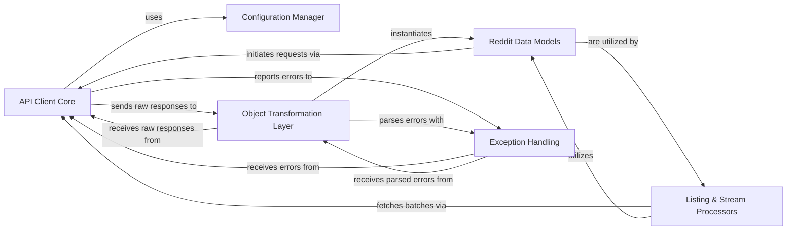

## Details

The PRAW architecture is designed as a robust API wrapper, providing an object-oriented interface to the Reddit API. It centers around the `API Client Core`, which orchestrates all network interactions, leveraging the `Configuration Manager` for settings and delegating raw response processing to the `Object Transformation Layer`. This layer is responsible for mapping raw API data into rich `Reddit Data Models`, which encapsulate Reddit entities and their behaviors. For handling collections and real-time data, the `Listing & Stream Processors` work in conjunction with the `API Client Core` and `Reddit Data Models`. Critical to its reliability, the `Exception Handling` component provides structured error reporting across the system. This design ensures a clear separation of concerns, facilitating maintainability, extensibility, and a developer-friendly experience, making it ideal for both documentation and visual flow graph representation.

### API Client Core [[Expand]](./API_Client_Core.md)
The central orchestrator for all interactions with the Reddit API, managing HTTP requests, authentication, and rate limiting.

**Related Classes/Methods**:

- <a href="https://github.com/CodeBoarding/praw/blob/main/praw/reddit.py" target="_blank" rel="noopener noreferrer">`praw.reddit.Reddit.__init__`</a>
- <a href="https://github.com/CodeBoarding/praw/blob/main/praw/reddit.py" target="_blank" rel="noopener noreferrer">`praw.reddit.Reddit.request`</a>
- <a href="https://github.com/CodeBoarding/praw/blob/main/praw/reddit.py" target="_blank" rel="noopener noreferrer">`praw.reddit.Reddit._objectify_request`</a>
- <a href="https://github.com/CodeBoarding/praw/blob/main/praw/reddit.py" target="_blank" rel="noopener noreferrer">`praw.reddit.Reddit._handle_rate_limit`</a>

### Configuration Manager
Handles the loading, storage, and provision of PRAW's operational settings, including API credentials and user agent strings.

**Related Classes/Methods**:

- <a href="https://github.com/CodeBoarding/praw/blob/main/praw/config.py" target="_blank" rel="noopener noreferrer">`praw.config.Config.__init__`</a>
- <a href="https://github.com/CodeBoarding/praw/blob/main/praw/config.py" target="_blank" rel="noopener noreferrer">`praw.config.Config._load_config`</a>

### Object Transformation Layer [[Expand]](./Object_Transformation_Layer.md)
Acts as a data mapper, converting raw JSON responses from the Reddit API into rich, object-oriented Python representations (`Reddit Data Models`).

**Related Classes/Methods**:

- <a href="https://github.com/CodeBoarding/praw/blob/main/praw/objector.py" target="_blank" rel="noopener noreferrer">`praw.objector.Objector.objectify`</a>
- <a href="https://github.com/CodeBoarding/praw/blob/main/praw/objector.py" target="_blank" rel="noopener noreferrer">`praw.objector.Objector.check_error`</a>

### Reddit Data Models [[Expand]](./Reddit_Data_Models.md)
A comprehensive set of classes representing various Reddit entities (e.g., `Subreddit`, `Submission`, `Comment`, `Redditor`). These models encapsulate data and provide high-level methods for interacting with their respective API endpoints.

**Related Classes/Methods**:

- <a href="https://github.com/CodeBoarding/praw/blob/main/praw/models/reddit/subreddit.py" target="_blank" rel="noopener noreferrer">`praw.models.reddit.subreddit.Subreddit.submit`</a>
- <a href="https://github.com/CodeBoarding/praw/blob/main/praw/models/reddit/submission.py" target="_blank" rel="noopener noreferrer">`praw.models.reddit.submission.Submission._fetch_data`</a>
- <a href="https://github.com/CodeBoarding/praw/blob/main/praw/models/reddit/comment.py" target="_blank" rel="noopener noreferrer">`praw.models.reddit.comment.Comment.parent`</a>
- <a href="https://github.com/CodeBoarding/praw/blob/main/praw/models/reddit/redditor.py" target="_blank" rel="noopener noreferrer">`praw.models.reddit.redditor.Redditor._fetch_info`</a>
- <a href="https://github.com/CodeBoarding/praw/blob/main/praw/models/reddit/mixins/votable.py" target="_blank" rel="noopener noreferrer">`praw.models.reddit.mixins.votable.VotableMixin._vote`</a>

### Listing & Stream Processors [[Expand]](./Listing_Stream_Processors.md)
Provides mechanisms for iterating through paginated API responses (listings) and consuming real-time data streams from Reddit, handling pagination logic and item uniqueness.

**Related Classes/Methods**:

- <a href="https://github.com/CodeBoarding/praw/blob/main/praw/models/listing/generator.py" target="_blank" rel="noopener noreferrer">`praw.models.listing.generator.ListingGenerator.__next__`</a>
- <a href="https://github.com/CodeBoarding/praw/blob/main/praw/models/listing/generator.py" target="_blank" rel="noopener noreferrer">`praw.models.listing.generator.ListingGenerator._next_batch`</a>

### Exception Handling [[Expand]](./Exception_Handling.md)
Defines a hierarchy of custom exception classes specific to PRAW and provides utilities to translate raw API error messages into structured exceptions.

**Related Classes/Methods**:

- <a href="https://github.com/CodeBoarding/praw/blob/main/praw/exceptions.py#L14-L15" target="_blank" rel="noopener noreferrer">`praw.exceptions.PRAWException`:14-15</a>
- <a href="https://github.com/CodeBoarding/praw/blob/main/praw/exceptions.py#L173-L189" target="_blank" rel="noopener noreferrer">`praw.exceptions.parse_exception_list`:173-189</a>

### [FAQ](https://github.com/CodeBoarding/GeneratedOnBoardings/tree/main?tab=readme-ov-file#faq)
