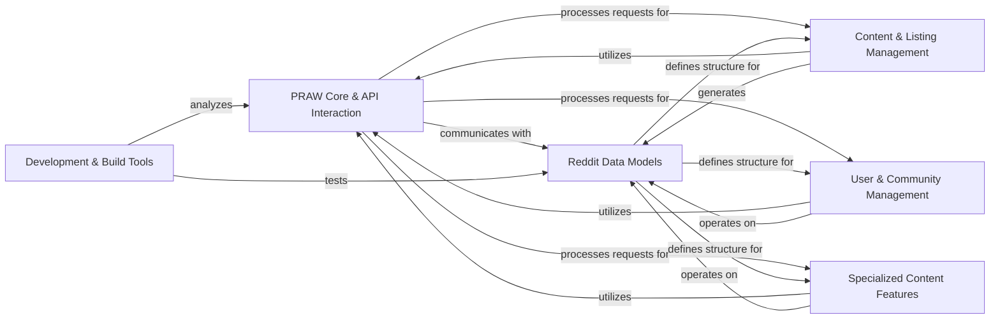

## Component Details

The PRAW library provides a Pythonic interface to the Reddit API, enabling developers to interact with Reddit programmatically. The main flow involves a core API interaction component that handles requests and responses, utilizing data models to represent Reddit entities. Various management components then leverage this core and data models to handle specific functionalities like content listing, user interactions, community moderation, and specialized content features. Development tools support the library's maintenance and release processes.

### PRAW Core & API Interaction
The foundational layer of the PRAW library, managing core interaction with the Reddit API. It handles client configuration, request objectification, and the processing of API responses, including error handling. It ensures all communications with Reddit are properly authenticated and formatted.

**Related Classes/Methods**:

- <a href="https://github.com/praw-dev/praw/blob/master/praw/reddit.py#L57-L901" target="_blank" rel="noopener noreferrer">`praw.praw.reddit.Reddit` (57:901)</a>
- <a href="https://github.com/praw-dev/praw/blob/master/praw/objector.py#L17-L263" target="_blank" rel="noopener noreferrer">`praw.praw.objector.Objector` (17:263)</a>
- <a href="https://github.com/praw-dev/praw/blob/master/praw/exceptions.py#L158-L167" target="_blank" rel="noopener noreferrer">`praw.praw.exceptions.MediaPostFailed` (158:167)</a>
- <a href="https://github.com/praw-dev/praw/blob/master/praw/exceptions.py#L170-L201" target="_blank" rel="noopener noreferrer">`praw.praw.exceptions.RedditAPIException` (170:201)</a>
- <a href="https://github.com/praw-dev/praw/blob/master/praw/config.py#L27-L173" target="_blank" rel="noopener noreferrer">`praw.praw.config.Config` (27:173)</a>
- <a href="https://github.com/praw-dev/praw/blob/master/praw/util/snake.py#L6-L19" target="_blank" rel="noopener noreferrer">`praw.praw.util.snake` (6:19)</a>

### Reddit Data Models
Provides the fundamental base classes and mixins that define the structure and common behaviors of various Reddit entities (like submissions, comments, users, and subreddits). It serves as the blueprint for how PRAW represents data received from the Reddit API, enabling consistent attribute access and basic functionalities across different object types.

**Related Classes/Methods**:

- <a href="https://github.com/praw-dev/praw/blob/master/praw/models/base.py#L12-L47" target="_blank" rel="noopener noreferrer">`praw.praw.models.base.PRAWBase` (12:47)</a>
- <a href="https://github.com/praw-dev/praw/blob/master/praw/models/reddit/base.py#L16-L90" target="_blank" rel="noopener noreferrer">`praw.praw.models.reddit.base.RedditBase` (16:90)</a>
- <a href="https://github.com/praw-dev/praw/blob/master/praw/models/reddit/mixins/votable.py#L8-L92" target="_blank" rel="noopener noreferrer">`praw.praw.models.reddit.mixins.votable.VotableMixin` (8:92)</a>
- `praw.praw.models.reddit.mixins.ThingModerationMixin` (10:120)
- <a href="https://github.com/praw-dev/praw/blob/master/praw/models/list/base.py#L15-L54" target="_blank" rel="noopener noreferrer">`praw.praw.models.list.base.BaseList` (15:54)</a>

### Content & Listing Management
Responsible for efficiently retrieving and iterating through various types of content listings from Reddit, such as hot, new, or top posts. It also provides utilities for real-time data streams and handles the creation, retrieval, and general management of Reddit submissions (posts) and comments, including drafts and poll data.

**Related Classes/Methods**:

- <a href="https://github.com/praw-dev/praw/blob/master/praw/models/listing/generator.py#L17-L103" target="_blank" rel="noopener noreferrer">`praw.praw.models.listing.generator.ListingGenerator` (17:103)</a>
- <a href="https://github.com/praw-dev/praw/blob/master/praw/models/listing/domain.py#L14-L25" target="_blank" rel="noopener noreferrer">`praw.praw.models.listing.domain.DomainListing` (14:25)</a>
- <a href="https://github.com/praw-dev/praw/blob/master/praw/models/listing/mixins/redditor.py#L18-L32" target="_blank" rel="noopener noreferrer">`praw.praw.models.listing.mixins.redditor.SubListing` (18:32)</a>
- <a href="https://github.com/praw-dev/praw/blob/master/praw/models/listing/mixins/redditor.py#L35-L185" target="_blank" rel="noopener noreferrer">`praw.praw.models.listing.mixins.redditor.RedditorListingMixin` (35:185)</a>
- <a href="https://github.com/praw-dev/praw/blob/master/praw/models/listing/mixins/subreddit.py#L20-L46" target="_blank" rel="noopener noreferrer">`praw.praw.models.listing.mixins.subreddit.CommentHelper` (20:46)</a>
- <a href="https://github.com/praw-dev/praw/blob/master/praw/models/listing/mixins/subreddit.py#L49-L73" target="_blank" rel="noopener noreferrer">`praw.praw.models.listing.mixins.subreddit.SubredditListingMixin` (49:73)</a>
- <a href="https://github.com/praw-dev/praw/blob/master/praw/models/listing/mixins/rising.py#L17-L34" target="_blank" rel="noopener noreferrer">`praw.praw.models.listing.mixins.rising.RisingListingMixin` (17:34)</a>
- <a href="https://github.com/praw-dev/praw/blob/master/praw/models/listing/mixins/base.py#L15-L149" target="_blank" rel="noopener noreferrer">`praw.praw.models.listing.mixins.base.BaseListingMixin` (15:149)</a>
- <a href="https://github.com/praw-dev/praw/blob/master/praw/models/listing/mixins/submission.py#L17-L42" target="_blank" rel="noopener noreferrer">`praw.praw.models.listing.mixins.submission.SubmissionListingMixin` (17:42)</a>
- <a href="https://github.com/praw-dev/praw/blob/master/praw/models/util.py#L10-L190" target="_blank" rel="noopener noreferrer">`praw.praw.models.util` (10:190)</a>
- <a href="https://github.com/praw-dev/praw/blob/master/praw/models/comment_forest.py#L15-L202" target="_blank" rel="noopener noreferrer">`praw.praw.models.comment_forest.CommentForest` (15:202)</a>
- <a href="https://github.com/praw-dev/praw/blob/master/praw/models/reddit/comment.py#L19-L311" target="_blank" rel="noopener noreferrer">`praw.praw.models.reddit.comment.Comment` (19:311)</a>
- <a href="https://github.com/praw-dev/praw/blob/master/praw/models/reddit/comment.py#L314-L350" target="_blank" rel="noopener noreferrer">`praw.praw.models.reddit.comment.CommentModeration` (314:350)</a>
- <a href="https://github.com/praw-dev/praw/blob/master/praw/models/reddit/more.py#L14-L87" target="_blank" rel="noopener noreferrer">`praw.praw.models.reddit.more.MoreComments` (14:87)</a>
- <a href="https://github.com/praw-dev/praw/blob/master/praw/models/reddit/submission.py#L395-L916" target="_blank" rel="noopener noreferrer">`praw.praw.models.reddit.submission.Submission` (395:916)</a>
- <a href="https://github.com/praw-dev/praw/blob/master/praw/models/reddit/submission.py#L40-L90" target="_blank" rel="noopener noreferrer">`praw.praw.models.reddit.submission.SubmissionFlair` (40:90)</a>
- <a href="https://github.com/praw-dev/praw/blob/master/praw/models/reddit/submission.py#L93-L392" target="_blank" rel="noopener noreferrer">`praw.praw.models.reddit.submission.SubmissionModeration` (93:392)</a>
- <a href="https://github.com/praw-dev/praw/blob/master/praw/models/helpers.py#L20-L133" target="_blank" rel="noopener noreferrer">`praw.praw.models.helpers.DraftHelper` (20:133)</a>
- <a href="https://github.com/praw-dev/praw/blob/master/praw/models/reddit/draft.py#L17-L292" target="_blank" rel="noopener noreferrer">`praw.praw.models.reddit.draft.Draft` (17:292)</a>
- <a href="https://github.com/praw-dev/praw/blob/master/praw/models/reddit/poll.py#L47-L112" target="_blank" rel="noopener noreferrer">`praw.praw.models.reddit.poll.PollData` (47:112)</a>
- <a href="https://github.com/praw-dev/praw/blob/master/praw/models/reddit/poll.py#L11-L44" target="_blank" rel="noopener noreferrer">`praw.praw.models.reddit.poll.PollOption` (11:44)</a>

### User & Community Management
This comprehensive component provides all tools necessary for managing user accounts, interacting with individual Redditor profiles, and moderating subreddits. It covers user preferences, inbox management, subreddit creation, moderation tools (modmail, notes, rules, removal reasons, wiki pages, widgets, emojis), and relationships within communities.

**Related Classes/Methods**:

- <a href="https://github.com/praw-dev/praw/blob/master/praw/models/front.py#L17-L32" target="_blank" rel="noopener noreferrer">`praw.praw.models.front.Front` (17:32)</a>
- <a href="https://github.com/praw-dev/praw/blob/master/praw/models/inbox.py#L18-L324" target="_blank" rel="noopener noreferrer">`praw.praw.models.inbox.Inbox` (18:324)</a>
- <a href="https://github.com/praw-dev/praw/blob/master/praw/models/auth.py#L11-L125" target="_blank" rel="noopener noreferrer">`praw.praw.models.auth.Auth` (11:125)</a>
- <a href="https://github.com/praw-dev/praw/blob/master/praw/models/user.py#L24-L259" target="_blank" rel="noopener noreferrer">`praw.praw.models.user.User` (24:259)</a>
- <a href="https://github.com/praw-dev/praw/blob/master/praw/models/redditors.py#L26-L104" target="_blank" rel="noopener noreferrer">`praw.praw.models.redditors.Redditors` (26:104)</a>
- <a href="https://github.com/praw-dev/praw/blob/master/praw/models/reddit/redditor.py#L21-L409" target="_blank" rel="noopener noreferrer">`praw.praw.models.reddit.redditor.Redditor` (21:409)</a>
- <a href="https://github.com/praw-dev/praw/blob/master/praw/models/reddit/redditor.py#L412-L457" target="_blank" rel="noopener noreferrer">`praw.praw.models.reddit.redditor.RedditorStream` (412:457)</a>
- <a href="https://github.com/praw-dev/praw/blob/master/praw/models/reddit/user_subreddit.py#L14-L78" target="_blank" rel="noopener noreferrer">`praw.praw.models.reddit.user_subreddit.UserSubreddit` (14:78)</a>
- <a href="https://github.com/praw-dev/praw/blob/master/praw/models/reddit/user_subreddit.py#L82-L199" target="_blank" rel="noopener noreferrer">`praw.praw.models.reddit.user_subreddit.UserSubredditModeration` (82:199)</a>
- <a href="https://github.com/praw-dev/praw/blob/master/praw/models/subreddits.py#L19-L133" target="_blank" rel="noopener noreferrer">`praw.praw.models.subreddits.Subreddits` (19:133)</a>
- <a href="https://github.com/praw-dev/praw/blob/master/praw/models/helpers.py#L301-L353" target="_blank" rel="noopener noreferrer">`praw.praw.models.helpers.SubredditHelper` (301:353)</a>
- <a href="https://github.com/praw-dev/praw/blob/master/praw/models/reddit/subreddit.py#L200-L350" target="_blank" rel="noopener noreferrer">`praw.praw.models.reddit.subreddit.Subreddit` (200:350)</a>
- <a href="https://github.com/praw-dev/praw/blob/master/praw/models/reddit/subreddit.py#L500-L520" target="_blank" rel="noopener noreferrer">`praw.praw.models.reddit.subreddit.SubredditRelationship` (500:520)</a>
- <a href="https://github.com/praw-dev/praw/blob/master/praw/models/reddit/subreddit.py#L523-L560" target="_blank" rel="noopener noreferrer">`praw.praw.models.reddit.subreddit.SubredditStream` (523:560)</a>
- <a href="https://github.com/praw-dev/praw/blob/master/praw/models/reddit/subreddit.py#L563-L680" target="_blank" rel="noopener noreferrer">`praw.praw.models.reddit.subreddit.SubredditStylesheet` (563:680)</a>
- <a href="https://github.com/praw-dev/praw/blob/master/praw/models/reddit/subreddit.py#L683-L800" target="_blank" rel="noopener noreferrer">`praw.praw.models.reddit.subreddit.ModeratorRelationship` (683:800)</a>
- <a href="https://github.com/praw-dev/praw/blob/master/praw/models/reddit/subreddit.py#L20-L100" target="_blank" rel="noopener noreferrer">`praw.praw.models.reddit.subreddit.Modmail` (20:100)</a>
- <a href="https://github.com/praw-dev/praw/blob/master/praw/models/reddit/subreddit.py#L200-L350" target="_blank" rel="noopener noreferrer">`praw.praw.models.reddit.subreddit.SubredditFlair` (200:350)</a>
- <a href="https://github.com/praw-dev/praw/blob/master/praw/models/reddit/subreddit.py#L353-L490" target="_blank" rel="noopener noreferrer">`praw.praw.models.reddit.subreddit.SubredditFlairTemplates` (353:490)</a>
- <a href="https://github.com/praw-dev/praw/blob/master/praw/models/reddit/subreddit.py#L500-L700" target="_blank" rel="noopener noreferrer">`praw.praw.models.reddit.subreddit.SubredditModeration` (500:700)</a>
- <a href="https://github.com/praw-dev/praw/blob/master/praw/models/reddit/subreddit.py#L703-L740" target="_blank" rel="noopener noreferrer">`praw.praw.models.reddit.subreddit.SubredditModerationStream` (703:740)</a>
- <a href="https://github.com/praw-dev/praw/blob/master/praw/models/reddit/subreddit.py#L743-L780" target="_blank" rel="noopener noreferrer">`praw.praw.models.reddit.subreddit.SubredditWiki` (743:780)</a>
- <a href="https://github.com/praw-dev/praw/blob/master/praw/models/mod_notes.py#L22-L271" target="_blank" rel="noopener noreferrer">`praw.praw.models.mod_notes.BaseModNotes` (22:271)</a>
- <a href="https://github.com/praw-dev/praw/blob/master/praw/models/mod_notes.py#L274-L367" target="_blank" rel="noopener noreferrer">`praw.praw.models.mod_notes.RedditorModNotes` (274:367)</a>
- <a href="https://github.com/praw-dev/praw/blob/master/praw/models/mod_notes.py#L370-L463" target="_blank" rel="noopener noreferrer">`praw.praw.models.mod_notes.SubredditModNotes` (370:463)</a>
- <a href="https://github.com/praw-dev/praw/blob/master/praw/models/mod_notes.py#L466-L682" target="_blank" rel="noopener noreferrer">`praw.praw.models.mod_notes.RedditModNotes` (466:682)</a>
- <a href="https://github.com/praw-dev/praw/blob/master/praw/models/reddit/modmail.py#L28-L325" target="_blank" rel="noopener noreferrer">`praw.praw.models.reddit.modmail.ModmailConversation` (28:325)</a>
- <a href="https://github.com/praw-dev/praw/blob/master/praw/models/reddit/modmail.py#L328-L329" target="_blank" rel="noopener noreferrer">`praw.praw.models.reddit.modmail.ModmailAction` (328:329)</a>
- <a href="https://github.com/praw-dev/praw/blob/master/praw/models/reddit/modmail.py#L332-L333" target="_blank" rel="noopener noreferrer">`praw.praw.models.reddit.modmail.ModmailMessage` (332:333)</a>
- <a href="https://github.com/praw-dev/praw/blob/master/praw/models/reddit/rules.py#L19-L100" target="_blank" rel="noopener noreferrer">`praw.praw.models.reddit.rules.Rule` (19:100)</a>
- <a href="https://github.com/praw-dev/praw/blob/master/praw/models/reddit/rules.py#L189-L314" target="_blank" rel="noopener noreferrer">`praw.praw.models.reddit.rules.SubredditRules` (189:314)</a>
- <a href="https://github.com/praw-dev/praw/blob/master/praw/models/reddit/rules.py#L103-L186" target="_blank" rel="noopener noreferrer">`praw.praw.models.reddit.rules.RuleModeration` (103:186)</a>
- <a href="https://github.com/praw-dev/praw/blob/master/praw/models/reddit/rules.py#L317-L413" target="_blank" rel="noopener noreferrer">`praw.praw.models.reddit.rules.SubredditRulesModeration` (317:413)</a>
- <a href="https://github.com/praw-dev/praw/blob/master/praw/models/reddit/removal_reasons.py#L18-L114" target="_blank" rel="noopener noreferrer">`praw.praw.models.reddit.removal_reasons.RemovalReason` (18:114)</a>
- <a href="https://github.com/praw-dev/praw/blob/master/praw/models/reddit/removal_reasons.py#L117-L223" target="_blank" rel="noopener noreferrer">`praw.praw.models.reddit.removal_reasons.SubredditRemovalReasons` (117:223)</a>
- <a href="https://github.com/praw-dev/praw/blob/master/praw/models/reddit/wikipage.py#L146-L314" target="_blank" rel="noopener noreferrer">`praw.praw.models.reddit.wikipage.WikiPage` (146:314)</a>
- <a href="https://github.com/praw-dev/praw/blob/master/praw/models/reddit/wikipage.py#L19-L143" target="_blank" rel="noopener noreferrer">`praw.praw.models.reddit.wikipage.WikiPageModeration` (19:143)</a>
- <a href="https://github.com/praw-dev/praw/blob/master/praw/models/reddit/emoji.py#L16-L131" target="_blank" rel="noopener noreferrer">`praw.praw.models.reddit.emoji.Emoji` (16:131)</a>
- <a href="https://github.com/praw-dev/praw/blob/master/praw/models/reddit/emoji.py#L134-L234" target="_blank" rel="noopener noreferrer">`praw.praw.models.reddit.emoji.SubredditEmoji` (134:234)</a>
- <a href="https://github.com/praw-dev/praw/blob/master/praw/models/reddit/widgets.py#L177-L361" target="_blank" rel="noopener noreferrer">`praw.praw.models.reddit.widgets.SubredditWidgets` (177:361)</a>
- <a href="https://github.com/praw-dev/praw/blob/master/praw/models/reddit/widgets.py#L364-L395" target="_blank" rel="noopener noreferrer">`praw.praw.models.reddit.widgets.Widget` (364:395)</a>
- <a href="https://github.com/praw-dev/praw/blob/master/praw/models/reddit/widgets.py#L639-L710" target="_blank" rel="noopener noreferrer">`praw.praw.models.reddit.widgets.CustomWidget` (639:710)</a>
- <a href="https://github.com/praw-dev/praw/blob/master/praw/models/reddit/widgets.py#L894-L933" target="_blank" rel="noopener noreferrer">`praw.praw.models.reddit.widgets.ModeratorsWidget` (894:933)</a>
- <a href="https://github.com/praw-dev/praw/blob/master/praw/models/reddit/widgets.py#L623-L640" target="_blank" rel="noopener noreferrer">`praw.praw.models.reddit.widgets.RulesWidget` (623:640)</a>
- <a href="https://github.com/praw-dev/praw/blob/master/praw/models/reddit/widgets.py#L283-L390" target="_blank" rel="noopener noreferrer">`praw.praw.models.reddit.widgets.SubredditWidgetsModeration` (283:390)</a>
- <a href="https://github.com/praw-dev/praw/blob/master/praw/models/reddit/widgets.py#L410-L497" target="_blank" rel="noopener noreferrer">`praw.praw.models.reddit.widgets.ButtonWidget` (410:497)</a>
- <a href="https://github.com/praw-dev/praw/blob/master/praw/models/reddit/widgets.py#L500-L571" target="_blank" rel="noopener noreferrer">`praw.praw.models.reddit.widgets.Calendar` (500:571)</a>
- <a href="https://github.com/praw-dev/praw/blob/master/praw/models/reddit/widgets.py#L574-L636" target="_blank" rel="noopener noreferrer">`praw.praw.models.reddit.widgets.CommunityList` (574:636)</a>
- <a href="https://github.com/praw-dev/praw/blob/master/praw/models/reddit/widgets.py#L713-L748" target="_blank" rel="noopener noreferrer">`praw.praw.models.reddit.widgets.IDCard` (713:748)</a>
- <a href="https://github.com/praw-dev/praw/blob/master/praw/models/reddit/widgets.py#L751-L820" target="_blank" rel="noopener noreferrer">`praw.praw.models.reddit.widgets.ImageWidget` (751:820)</a>
- <a href="https://github.com/praw-dev/praw/blob/master/praw/models/reddit/widgets.py#L823-L891" target="_blank" rel="noopener noreferrer">`praw.praw.models.reddit.widgets.Menu` (823:891)</a>
- <a href="https://github.com/praw-dev/praw/blob/master/praw/models/reddit/widgets.py#L936-L1000" target="_blank" rel="noopener noreferrer">`praw.praw.models.reddit.widgets.PostFlairWidget` (936:1000)</a>
- <a href="https://github.com/praw-dev/praw/blob/master/praw/models/reddit/widgets.py#L1000-L1090" target="_blank" rel="noopener noreferrer">`praw.praw.models.reddit.widgets.TextArea` (1000:1090)</a>

### Specialized Content Features
Manages specialized content types on Reddit, including Live Threads, Multireddits, and Collections. It provides dedicated interfaces for interacting with these unique content structures and their specific functionalities.

**Related Classes/Methods**:

- <a href="https://github.com/praw-dev/praw/blob/master/praw/models/helpers.py#L136-L238" target="_blank" rel="noopener noreferrer">`praw.praw.models.helpers.LiveHelper` (136:238)</a>
- <a href="https://github.com/praw-dev/praw/blob/master/praw/models/reddit/live.py#L22-L258" target="_blank" rel="noopener noreferrer">`praw.praw.models.reddit.live.LiveContributorRelationship` (22:258)</a>
- <a href="https://github.com/praw-dev/praw/blob/master/praw/models/reddit/live.py#L261-L471" target="_blank" rel="noopener noreferrer">`praw.praw.models.reddit.live.LiveThread` (261:471)</a>
- <a href="https://github.com/praw-dev/praw/blob/master/praw/models/reddit/live.py#L474-L582" target="_blank" rel="noopener noreferrer">`praw.praw.models.reddit.live.LiveThreadContribution` (474:582)</a>
- <a href="https://github.com/praw-dev/praw/blob/master/praw/models/reddit/live.py#L585-L637" target="_blank" rel="noopener noreferrer">`praw.praw.models.reddit.live.LiveThreadStream` (585:637)</a>
- <a href="https://github.com/praw-dev/praw/blob/master/praw/models/reddit/live.py#L700-L792" target="_blank" rel="noopener noreferrer">`praw.praw.models.reddit.live.LiveUpdate` (700:792)</a>
- <a href="https://github.com/praw-dev/praw/blob/master/praw/models/reddit/live.py#L640-L697" target="_blank" rel="noopener noreferrer">`praw.praw.models.reddit.live.LiveUpdateContribution` (640:697)</a>
- <a href="https://github.com/praw-dev/praw/blob/master/praw/models/helpers.py#L241-L298" target="_blank" rel="noopener noreferrer">`praw.praw.models.helpers.MultiredditHelper` (241:298)</a>
- <a href="https://github.com/praw-dev/praw/blob/master/praw/models/reddit/multi.py#L20-L228" target="_blank" rel="noopener noreferrer">`praw.praw.models.reddit.multi.Multireddit` (20:228)</a>
- <a href="https://github.com/praw-dev/praw/blob/master/praw/models/reddit/collections.py#L21-L216" target="_blank" rel="noopener noreferrer">`praw.praw.models.reddit.collections.CollectionModeration` (21:216)</a>
- <a href="https://github.com/praw-dev/praw/blob/master/praw/models/reddit/collections.py#L219-L288" target="_blank" rel="noopener noreferrer">`praw.praw.models.reddit.collections.SubredditCollectionsModeration` (219:288)</a>
- <a href="https://github.com/praw-dev/praw/blob/master/praw/models/reddit/collections.py#L291-L377" target="_blank" rel="noopener noreferrer">`praw.praw.models.reddit.collections.SubredditCollections` (291:377)</a>
- <a href="https://github.com/praw-dev/praw/blob/master/praw/models/reddit/collections.py#L380-L575" target="_blank" rel="noopener noreferrer">`praw.praw.models.reddit.collections.Collection` (380:575)</a>

### Development & Build Tools
This component comprises scripts and utilities primarily used for the development, testing, and release management of the PRAW library itself. It includes tools for static analysis, unit testing, and version control, and is not part of the library's runtime functionality.

**Related Classes/Methods**:

- <a href="https://github.com/praw-dev/praw/blob/master/pre_push.py#L2-L80" target="_blank" rel="noopener noreferrer">`praw.pre_push` (2:80)</a>
- <a href="https://github.com/praw-dev/praw/blob/master/tools/static_word_checks.py#L5-L100" target="_blank" rel="noopener noreferrer">`praw.tools.static_word_checks` (5:100)</a>
- <a href="https://github.com/praw-dev/praw/blob/master/tools/check_documentation.py#L5-L70" target="_blank" rel="noopener noreferrer">`praw.tools.check_documentation` (5:70)</a>
- <a href="https://github.com/praw-dev/praw/blob/master/tools/set_active_docs.py#L5-L80" target="_blank" rel="noopener noreferrer">`praw.tools.set_active_docs` (5:80)</a>
- <a href="https://github.com/praw-dev/praw/blob/master/tools/set_version.py#L5-L100" target="_blank" rel="noopener noreferrer">`praw.tools.set_version` (5:100)</a>

### [FAQ](https://github.com/CodeBoarding/GeneratedOnBoardings/tree/main?tab=readme-ov-file#faq)